

  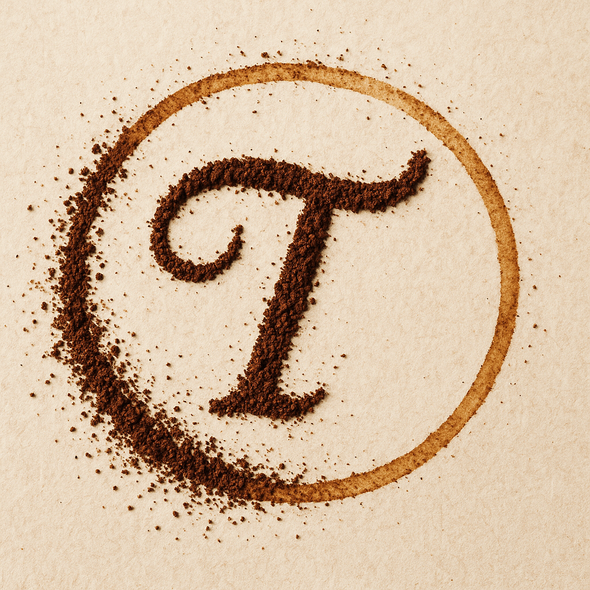
  <h1 class="hero-title">Tassea</h1>
  
The Smart Loyalty Platform for Coffee Lovers

  <a href="#project-description" class="hero-button">Explore the Project ↓</a>

---

# ☕ **Tassea – The Smart Loyalty Platform for Specialty Coffee Shops**

Welcome to **Tassea** — a platform designed for specialty coffee shops and their customers.  
This page outlines the project concept, team, problem, solution and business model.

---

## Team & Roles

| Name | Role | Email | Photo |
|------|------|--------|-------|
| Ana Gabriela Almăjanu | Project Manager & Backend Developer | [ana.almajanu@gmail.com](mailto:ana.almajanu@gmail.com) |  |
| Irene Mihaela Mușat | UI/UX Designer & Frontend Developer | [irenemiha@gmail.com](mailto:irenemiha@gmail.com) |  |
| Andrei Mihai Cosmin | Backend Engineer & Database Specialist | [andreimihaicosmin@yahoo.com](mailto:andreimihaicosmin@yahoo.com) | 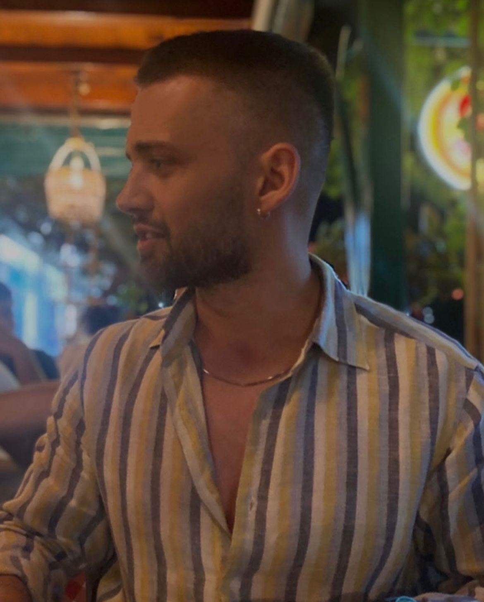 |
| Cristian Constantin | Mobile App Developer & Creative Director | [constantincristian05@icloud.com](mailto:constantincristian05@icloud.com) |  |

> ☕ The team combines expertise in software development, UX design and business management to create a useful and scalable product.

---

## Problem Statement

Most **specialty coffee shops** don’t have a loyalty or fidelity program, even though this would help in attracting more customers.  
The traditional **stamp card system** is inconvenient, since customers often forget it at home or lose it.  

Creating an **individual digital app** for each coffee shop isn’t practical — it’s expensive, difficult to maintain, and there’s no widely adopted platform focused on specialty coffee shops.  
Existing “loyalty-only” apps bring little added value to the business.

---

## Solution / Value Proposition

**Tassea** aims to be a **shared platform** for specialty coffee shops that provides:

- **Core loyalty functionality** (customers collect points or stamps through recurring visits);  
- **Business analytics** with insights about customer behavior and trends;  
- **Real-time occupancy tracking**, helping users decide where to go based on crowd levels;  
- **Feedback & discovery features**, allowing customers to explore new shops and interact directly with owners.

> Tassea bridges the gap between customer engagement and valuable business data, creating a win-win ecosystem.

---

## Customer Segment

Tassea primarily targets **Gen Z** and **Millennials under 45 years old**, who frequently visit local coffee shops and use mobile apps daily.  
The segment can expand depending on the onboarding strategy and regional market.

---

## Competition

| Competitor | Description | Limitation |
|-------------|-------------|-------------|
| **Stampino** | Offers basic digital stamp cards. Users earn 1 stamp per visit and get a free coffee after 9 stamps. | Only one feature (loyalty cards), very limited coffee shop selection, and stamps don’t transfer between shops. |

---

## Tassea’s Advantage

Unlike competitors, **Tassea** goes beyond loyalty:

- Real-time occupancy information  
- Discovery page for exploring new coffee shops  
- Feedback and communication channel between customers and shop owners  
- Business analytics for shop owners  
- A cleaner, more engaging user experience  

These features add tangible value for both customers and businesses.

---

## Key Metrics

Tassea tracks and optimizes both customer and business performance indicators.

| Category | Metrics |
|-----------|----------|
| **B2C (Customer Side)** | New user signups, activation rate, daily active users (DAU), occupancy checks per user, user retention, churn rate |
| **B2B (Business Side)** | Number of partner coffee shops, monthly onboarding growth, shop retention, loyalty participation rate, churned coffee shops |

---

## Cost Structure

- Platform development and maintenance  
- Cloud hosting and database services  
- Design, marketing, and branding  
- Business partnerships and outreach  

---

## Revenue Streams

**Subscription model for coffee shops**, available in pricing tiers:

- ☕ **Basic** – $99/month  
- ☕ **Pro** – $149/month  
- ☕ **Enterprise** – custom plans for larger chains  

---

## Idea Summary 

Through thorough customer discovery and behavioral validation, **Tassea** confirmed that the lack of a unified, digital loyalty experience is a real and recurring problem in the specialty coffee market.  
The proposed solution provides measurable value for both customers and business owners, laying the foundation for a sustainable and scalable platform.  
Built on validated insights, **Tassea** stands as a smart, data-driven bridge between coffee lovers and their favorite cafés.

---

## Customer Discovery & Validation

Before developing the platform, the team conducted a detailed **Customer Discovery** process to confirm that the problem we aimed to solve was real and worth addressing.  
We approached this through **in-person interviews**, **interviews over the phone** and an **online survey** structured using the **Mom Test** framework, which focuses on real experiences and observable behavior rather than hypothetical scenarios.

---

### Interviews with different coffe shop owners

> The recordings for the interviews that took place over the phone can be found here: https://drive.google.com/drive/folders/1Bqm3PT7d_mWMIck6K7O33ANU9BYIiXeq

??? note "Noi.2 Cafe – Coffess Shop Owner Interview – Ana (Intervievator)"

    1. Când vă gândiți la succesul vostru, cât de importantă este retenția clienților față de atragerea de clienți noi?

    Depinde de grupul de clienți. Dacă vorbim de categoria 16–20 de ani, nu este foarte important să rămână constanți, pentru că în industria cafenelelor de specialitate, prețurile sunt destul de ridicate, iar acest grup de vârstă consumă foarte puțin. Mai important pentru o cafenea este să aibă o comunitate și un grup puternic cuprins între 25 de ani în sus, pentru că aceștia au putere de cumpărare și pe aceștia ne dorim să-i fidelizăm cât de bine putem. Dacă aș fi un 5toGo, atunci m-aș axa pe cât mai mulți clienți noi, cât mai mulți în fiecare zi. În cazul nostru, vreau să îmi țin clienții cât mai aproape, pentru că am categoria 25+.

    2. Care simțiți că este cea mai mare provocare în a transforma un client care intră prima dată într-una din locații într-un client fidel?

    În prezent, în noiembrie 2025, este prețul. S-a scumpit foarte mult materia primă, de asemenea și taxele și impozitele; acest dezechilibru economic din țară la momentul actual creează cea mai mare provocare de a menține prețuri competitive. Pe lângă acest aspect, cea mai mare provocare ar fi să-i oferi clientului aceeași calitate de luni până duminică.

    3. Ați încercat vreodată în trecut un sistem de a răsplăti clienții fideli?

    Da, avem. Clienții apreciază gratuități și discounturi.

    4. Aveți vreo metodă acum prin care să puteți lua legătura direct cu cei mai fideli clienți ai voștri, separat de publicul larg de pe social media?

    Avem o comunitate pe WhatsApp, unde postăm informații și oferte. Cei care doresc să intre ne scriu direct când vor să facă parte din comunitate, ori intră direct folosind linkul de pe pagina de Instagram. Sunt destul de puțini; nu este un engagement foarte mare pe partea aceasta.

    5. Ați avut vreodată o situație în care ați fi vrut să știți mai multe despre tipologia clienților voștri (de ex. vârstă, frecvența vizitelor) pentru a lua o decizie de business? Puteți să-mi dați un exemplu?

    Nu.

    6. Gestionarea fluxului de clienți și a locurilor disponibile este vreodată o provocare?

    Poate să fie. Fiind o locație cu număr de locuri limitat, în weekend mai întâmpinăm probleme când oamenii vin și văd că toate mesele sunt ocupate, dar face parte din fluxul de clienți, din viața unei cafenele. Nu aș numi asta o problemă; este ceva normal.

    7. Simțiți că pierdeți clienți în orele de vârf pentru că locația pare plină din exterior sau pentru că timpul de așteptare e prea mare?

    Sunt clienți care iau to-go. Clienții care vin de weekend, de la o plimbare, nu vin neapărat cu scopul de a găsi o masă. Dacă vin și găsesc loc, sunt fericiți; dacă nu, pleacă mai departe.

    8. Să presupunem că lansați o nouă băutură, schimbați meniul sau organizați un eveniment. Cum anunțați clienții despre asta în momentul de față?

    Instagram și WhatsApp. Plus, dacă evenimentul este vineri, de luni până joi spunem despre acesta tuturor celor care vin la cafenea.

---

??? note "MUGSHOT – Coffess Shop Owner Interview – Ana (Intervievator)"

    1. Când vă gândiți la succesul vostru, cât de importantă este retenția clienților față de atragerea de clienți noi?

    Destul de importantă, deoarece clienții vechi aduc clienți noi, fie prin mijloacele de socializare, fie prin viu grai.

    2. Ați încercat vreodată în trecut un sistem de a răsplăti clienții fideli?

    Da, fie le oferim reduceri consistente, fie le oferim ceva din partea casei.

    3. Să presupunem că lansați o nouă băutură, schimbați meniul sau organizați un eveniment. Cum anunțați clienții despre asta în momentul de față?

    Promovăm evenimentele prin social media, în special Instagram, dar și prin promovare offline în cafenea.

    4. Aveți vreo metodă acum prin care să puteți lua legătura direct cu cei mai fideli clienți ai voștri, separat de publicul larg de pe social media?

    Nu, din păcate, momentan nu.

    5. Ați avut vreodată o situație în care ați fi vrut să știți mai multe despre tipologia clienților voștri (de ex. vârstă, frecvența vizitelor) pentru a lua o decizie de business? Puteți să-mi dați un exemplu?

    Nu, pentru că în momentul de față este destul de ușor să ne dăm seama cine ne trece pragul și cât de des vin, fiindcă ne aflăm între trei colegii/universități/licee. De obicei, oaspeții de dimineață sunt studenți și elevi, iar cei de seară sunt fie oameni din comunitate, persoane din acest cartier, fie persoane care au auzit de noi și vor să încerce băuturile, în special cocktailurile.

    6. Gestionarea fluxului de clienți și a locurilor disponibile este vreodată o provocare?

    Nu, pentru că avem locuri oarecum limitate și știm cum să le organizăm în funcție de clienți.

    7. Simțiți că pierdeți clienți în orele de vârf pentru că locația pare plină din exterior sau pentru că timpul de așteptare e prea mare?

    Nu, nu ne-am confruntat cu această problemă până acum.

---

??? note "Loom68 – Coffess Shop Owner Form Answers"

    1. Când vă gândiți la succesul celor două locații, cât de importantă este retenția clienților față de atragerea de clienți noi?

    Foarte importantă. Lucrăm constant prin marketing pentru a atrage clienți noi și pentru a ne mări comunitatea.

    2. Ce faceți în prezent pentru a încuraja clienții să revină la Loom68?

    Păstrăm calitatea serviciilor și găsim mereu soluții noi de fidelizare. De exemplu, am lansat propriul nostru brand de cafea, în parteneriat cu Origo.

    3. Care considerați că este cea mai mare provocare în a transforma un client care intră prima dată în locație într-un client fidel?

    Educarea lui în ceea ce privește specialty coffee și diferențierea noastră față de alte cafenele.

    4. Ați încercat vreodată în trecut un sistem de răsplătire a clienților fideli Loom68?

    Suntem în proces de a-l implementa.

    5. Să presupunem că lansați o nouă băutură, schimbați meniul sau organizați un eveniment. Cum anunțați clienții despre asta în prezent?

    Momentan doar prin Instagram, dar vrem să introducem și un newsletter pe e-mail.

    6. Aveți acum vreo metodă prin care să luați legătura direct cu cei mai fideli clienți ai voștri, separat de publicul larg de pe Instagram?

    În afară de Instagram, nu avem nimic direct.

    7. Cum realizați în prezent o analiză a clienților care vizitează Loom68 și a trendurilor, precum orele cele mai aglomerate sau cele mai comandate produse din meniu?

    Prin intermediul rapoartelor de vânzări, al stocurilor și al datelor din Google Maps privind orele de vârf la care oamenii caută cafeneaua.

    8. Ce fel de date despre vânzări sau clienți urmăriți în prezent? Folosiți rapoartele de la casa de marcat (POS)?

    Da, folosim programul de vânzare, foi de calcul și rapoarte legate de bonul mediu și de situația financiară.

    9. Ați avut vreodată o situație în care ați fi vrut să știți mai multe despre tipologia clienților voștri (de exemplu: vârstă, frecvența vizitelor) pentru a lua o decizie de business pentru Loom68? Puteți să-mi dați un exemplu?

    Până acum nu ne-am confruntat cu o astfel de situație, dar mi-ar plăcea să avem acces la astfel de informații.

    10. Gestionarea fluxului de clienți și a locurilor disponibile este vreodată o provocare?

    Momentan nu, dar pregătim ceva destul de radical în privința asta.

    11. Simțiți că pierdeți clienți în orele de vârf pentru că locația pare plină din exterior sau din cauza timpului de așteptare prea mare?

    Nu.

---

### Online survey targeting customers

Participants revealed that most specialty coffee shop visitors rarely or inconsistently use loyalty cards. Many said they **forgot or lost** their physical card, while shop owners confirmed they lack a simple, unified digital solution for customer retention.  
This confirmed that the problem wasn’t about disinterest but rather about **inconvenience and fragmentation** in existing systems.

The insights showed clear trends:  
- **67%** of respondents don’t use loyalty cards regularly.  
- **100%** expressed frustration after losing or forgetting a card.  
- **50%** abandoned a loyalty program due to complexity.  

Beyond loyalty, **83%** of participants said they had left a café because it was too crowded — a key validation for adding **real-time occupancy tracking**.  
They also shared that **Instagram** is their main source for discovering cafés, while **83%** delete retail app notifications immediately, suggesting that **pull-based engagement** works better than intrusive push notifications.

---

### Key Research Insights

| Question Focus | Main Finding | Validation Insight |
|----------------|---------------|--------------------|
| Why return to a café? | Quality and atmosphere matter most | Loyalty should support, not replace, experience |
| Use of loyalty cards | Low adoption (67% non-users) | Confirms usability gap |
| Forgotten card experiences | 100% frustration | Strong emotional pain point |
| Abandoning loyalty programs | 50% due to complexity | Need for simplicity |
| Leaving cafés due to crowds | 83% of users | Validates occupancy tracking feature |
| Discovering cafés/events | 67% via Instagram | Social-first marketing strategy |
| Notification behavior | 83% delete instantly | Avoid push; use pull UX |
| Curiosity about popular drinks | 83% interest | Opportunity for gamification and social proof |

---

## Product Impact

| Research Insight | Design Decision |
|------------------|----------------|
| Lost or forgotten cards | Introduced fully digital loyalty wallet |
| Complexity discourages users | One-tap stamp and reward collection |
| Overcrowding issues | Added real-time occupancy tracking |
| Notification fatigue | Replaced push notifications with in-app updates |
| Instagram discovery behavior | Built marketing around social-first channels |
| Curiosity for trends | Introduced “Top Drinks” leaderboard and discovery feed |

---

### From Discovery to Validation

These findings guided the development of **Tassea’s MVP**, focusing only on the most validated and high-value features.  
The problem has been verified through user behavior, emotional responses, and measurable patterns.  
The proposed solution aligns directly with what customers and café owners actually need: a digital, unified, simple, and data-driven loyalty experience.

Having confirmed the problem’s validity, the team is ready to move forward to the **Customer Validation stage**, where the goal is to test **real-world adoption** and **willingness to pay** through pilot programs with local coffee shops.  
Future testing will include A/B experiments with different reward structures, engagement metrics, and business conversion rates.

---

## **Milestone 3 - Landing Page and Wireframe**

### **Landing Page** 

https://irenemiha.github.io/Tassea-Landing-Page/

### **Wireframe** 

https://www.figma.com/design/JDFKhxI5rnJhUW1H8a17LA/Tassea-mobile-wireframe?node-id=0-1&t=nqhdsxksdpX9vvM0-1

---
## **Milestone 4 – Face-to-Face Interviews, Persona, User Stories, Use Cases & Updated Wireframes**

### **Face-to-Face User Interviews**

**Link to the recorded interviews**  - https://drive.google.com/drive/folders/1slP7vBlLztdQ4nviRn6BNh3Lw81_w3bf?usp=sharing

??? note "Transcriere Interviu – Ana (Intervievator) & Marius (Participant)"

    **Ana**  
    Bună. Povestește-mi de ultima dată când ai folosit o aplicație de loialitate pentru o cafenea de specialitate.  
    Cum a fost procesul pas cu pas?

    **Marius**  
    Nu cred că am folosit vreodată o aplicație de genul. Pare ceva ce poate ar trebui să folosesc, dar doar îmi place să dau mulți bani.  
    Nu folosesc.

    **Ana**  
    Ce aplicații folosești în momentul de față, care stochează toate cardurile de loialitate pentru diverse cafenele?

    **Marius**  
    Presupun că aș folosi ceva gen Apple Wallet sau Google Wallet, sau… nu știu, cred că așa se numesc.

    **Ana**  
    Ce frustrări ai întâmpinat în procesul curent de a folosi un card de loialitate?

    **Marius**  
    Având în vedere că n-am folosit până acum, niciuna.

    **Ana**  
    Ce frustrare ai întâmpinat când ai vrut să vezi cât de ocupată este o cafenea?

    **Marius**  
    Niciuna, adică, de obicei, mă uit pe geam și văd.

    **Ana**  
    Cât de des folosești cardul de loialitate?

    **Marius**  
    Destul de rar.

    **Ana**  
    Când te-ai lovit ultima dată de un moment în care ai fi vrut ca procesul să fie mai ușor pentru folosirea unor carduri de loialitate?

    **Marius**  
    La un moment dat foloseam card de loialitate la Mega Image și s-a actualizat aplicația și mi-a uitat cardul, iar eu nu mi l-am mai pus din nou, că era prea complicat.

    **Ana**  
    Acum o să-ți arăt aplicația.  
    Aici este ecranul de login.  
    Aici apare cardul de loialitate. Pentru ce crezi că este acest ecran?

    **Marius**  
    Păi probabil pentru rewards, având în vedere că scrie.

    **Ana**  
    Dacă ai vrea să folosești un card de loialitate pentru a revendica un premiu, pe ce butoane ai apăsa?  
    La general, de pe orice ecran.

    **Marius**  
    Nu știu, ori de jos, de la „Rewards”, sau… nu-mi dau seama exact dacă sunt pe pagina aia sau nu. Sunt pe pagină, pentru că scrie sus.  
    Păi, de exemplu, pentru prima cafenea aș apăsa pe săgeată sau pe cardul ăla și aș vedea ce se întâmplă.

    **Ana**  
    Este ceva neclar sau neașteptat în procesul de a folosi această aplicație?

    **Marius**  
    Nu știu, pare ok.

    **Ana**  
    Ți se pare că lipsește vreun pas sau vreo informație necesară?

    **Marius**  
    N-aș zice, adică ar trebui să o folosesc ca să îmi dau seama de lucruri de genul.

    **Ana**  
    Ce crezi că se va întâmpla dacă apeși butonul acesta de „Feed”?

    **Marius**  
    Habar n-am.

    **Ana**  
    Ți se pare un proces greoi, prea lung sau fix cum trebuie? Unde te-ai simțit blocat sau nesigur?  
    Procesul de a folosi cardurile de loialitate din această aplicație.

    **Marius**  
    Păi, nu mi-am dat seama cum s-ar sincroniza, de exemplu. Asta nu prea e clar. Adică eu văd aici ca și cum le-aș avea deja, dar nu știu cum aș ajunge aici.

    **Ana**  
    A existat vreun moment în care nu ai știut exact ce trebuie să faci mai departe? Poți să-mi arăți unde?

    **Marius**  
    Nu a fost.

    **Ana**  
    Pornind de la ce ai văzut și de la ce am discutat deja, când ai avut ultima dată nevoie să vezi câte puncte ai pe un card de loialitate și cum ai procedat?

    **Marius**  
    Nu știu, nu cred că am avut nevoie vreodată, adică nu cred că m-am uitat.

    **Ana**  
    Ce faci acum pentru a urmări punctele sau recompensele la cafenele?

    **Marius**  
    Având în vedere că n-am card de loialitate la cafenele, nimic.

    **Ana**  
    Ce te face să folosești aplicațiile de acest tip regulat, dacă le folosești? Ce te îndepărtează de a le folosi?

    **Marius**  
    Ar fi frumos să fie super ușor să îmi fac așa ceva. Adică să fie mai rapid, să fie un proces de fix 10 secunde.

    **Ana**  
    Care a fost ultimul moment când o aplicație de acest tip ți-a economisit timp sau bani?

    **Marius**  
    Niciodată, probabil.

    **Ana**  
    Poți să-mi povestești de ultima situație în care ai fi vrut să folosești o aplicație ca aceasta, dar nu ai avut una potrivită?

    **Marius**  
    Nu.

    **Ana**  
    Funcțiile disponibile în aplicația noastră sunt „Rewards”, „Discover” și „Feed“. Care este funcția pe care ai folosit-o cel mai mult într-o aplicație similară și ce funcții nu ai folosit deloc?

    **Marius**  
    Am folosit funcția de rewards, dar lucruri legate de discovery, de exemplu, nu am folosit niciodată.

    **Ana**  
    Poți să-mi povestești și de o aplicație similară pe care nu ai mai folosi-o niciodată? Ce s-a întâmplat?

    **Marius**  
    Da, păi, cum ziceam mai devreme: cardul de loialitate de la Mega Image am încetat să îl folosesc pentru că nu mai știam cum să îmi pun cardul înapoi în aplicație. Sau ar fi durat mai mult de 10 secunde.

??? note "Transcriere Interviu – Ana (Intervievator) & Ilinca (Participant)"

    **Ana**  
    Povestește-mi despre ultima dată când ai folosit o aplicație de loialitate pentru o cafenea de specialitate.  
    Cum a fost procesul pas cu pas?

    **Ilinca**  
    Ultima dată când am folosit o aplicație cred că a fost acum o săptămână sau două, în momentul în care am vrut să îmi iau o cafea de specialitate și nu a fost atât de complicat. Trebuie doar să dau pe cardul acela.

    **Ana**  
    Ce aplicații folosești în momentul de față ce stochează toate cardurile de loialitate pentru diverse cafenele? De ce le folosești, ce îți place la display?

    **Ilinca**  
    Eu folosesc wallet-ul de la telefon propriu-zis și acolo am toate cardurile de loialitate. Le folosesc pentru că e mult mai ușor în momentul în care am mai multe lucruri în mână, să doar dau dublu clic pe buton și mi se deschid.

    **Ana**  
    Ce frustrări ai întâmpinat în procesul curent de a folosi un card de loialitate, dar și în a vedea cât de ocupată este o cafenea?

    **Ilinca**  
    De obicei, la cardurile de loialitate, câteodată nu merg, nu știu de ce, specific la cardurile mele. Tuturor le merg, mie nu, dar o să aleg să cred că motivul este telefonul și nu cardul propriu-zis. Și legat de cât de ocupată este o cafenea, nu prea stau în cafenea propriu-zis să beau cafeaua. De obicei o iau to go.

    **Ana**  
    Cât de des folosești cardul de loialitate?

    **Ilinca**  
    Cam o dată pe săptămână.

    **Ana**  
    Când te-ai lovit ultima dată de un moment în care ai fi vrut ca procesul să fie mai ușor și ce anume era greu? Procesul efectiv de a folosi un card de loialitate?

    **Ilinca**  
    Cred că momentul în care mi-aș fi dorit să fie un pic mai ușor procesul a fost atunci când mi l-am făcut, pentru că, din nou, nu mergea ceva la el, nu găseau ceva sau nu exista în baza lor de date. Dar am rezolvat, asta contează acum.

    **Ana**  
    Aceasta este aplicația. Aici este ecranul de login și aici este efectiv cardul.

    **Ana**  
    Pentru ce crezi că este acest ecran? (Pagina de “Rewards”)

    **Ilinca**  
    Probabil efectiv cardurile.

    **Ana**  
    Dacă ai vrea să folosești un card de loialitate pentru a revendica un premiu, pe ce butoane ai apăsa? Poți să alegi de oriunde.

    **Ilinca**  
    Pe acesta. (A arătat spre acel simbol de cadou, de sub numele cafenelei, din pagina de “Rewards”)

    **Ana**  
    A fost ceva neclar sau neașteptat în procesul de a folosi această aplicație?

    **Ilinca**  
    Sincer, e un pic monotonă.  
    Nu are nimic care să te facă să vrei s-o folosești în mod special. Nu le vezi cu atâta ușurință. Nu îți sar în ochi absolut deloc.

    **Ana**  
    Ți se pare că lipsește vreun pas sau vreo informație necesară?

    **Ilinca**  
    Nu mi se pare neapărat că lipsește vreo informație, dar sunt în așa fel structurate încât nu-ți vine să apeși pe ele. Nu știu, eu nu le-aș fi aranjat așa.

    **Ana**  
    Ce crezi că se va întâmpla dacă apeși pe acest buton? (Butonul de “Feed”)

    **Ilinca**  
    Presupun că o să îți apară mai multe cafenele, mai multe chestii care se întâmplă în cafenele.

    **Ana**  
    Ți se pare un proces greoi, prea lung sau fix cât trebuie? Unde te-ai simțit blocată sau nesigură?

    **Ilinca**  
    M-aș bloca la alegerea unei cafenele, mi-ar fi greu să aleg una, dar asta e o problemă personală. Nu are legătură neapărat cu aplicația.  
    Nu cred că aș fi avut așa mari probleme. Dar dacă aș fi fost constrânsă de timp, probabil aș fi început să apăs pe toate butoanele doar ca să apară odată ce caut.

    **Ana**  
    A existat vreun moment în care nu ai știut sigur ce trebuie să faci mai departe? Poți să-mi arăți unde?

    **Ilinca**  
    Sincer, păi asta — de unde să îți revendici premiile. Adică nu îți sare în ochi, nu? Acolo aș fi întrebat sau aș fi cerut ajutorul unui barista sau cuiva din jurul meu.

    **Ana**  
    Pornind de la ce am văzut și de la ce am discutat deja, când ai avut ultima dată nevoia să vezi câte puncte ai pe un card de loialitate și cum ai procedat?

    **Ilinca**  
    Am primit un mail că am ajuns la numărul respectiv de puncte, dar în general, ca să fiu sigură că mi se înregistrează punctele, intru în aplicația cafenelei.

    **Ana**  
    Ce faci acum pentru a urmări punctele sau recompensele de la cafenele?

    **Ilinca**  
    Intru în aplicație.

    **Ana**  
    Ce te face să folosești aplicațiile de acest tip regulat atunci când le folosești sau ce te îndepărtează de a le folosi?

    **Ilinca**  
    Ce mă face să le folosesc ar fi faptul că e mult mai ușor decât să caut în multe email-uri când am primit eu niște puncte.  
    Ce m-ar îndepărta ar fi dacă ar fi foarte greoi să accesez acele puncte de loialitate.

    **Ana**  
    Care a fost ultimul moment când o aplicație de acest tip ți-a economisit timp sau bani și cum?

    **Ilinca**  
    Cred că de curând am avut o reducere la o cafenea. Fusese un pachet promoțional, ceva de genul acesta.

    **Ana**  
    Poți să-mi povestești de ultima situație în care ai fi vrut să folosești o aplicație ca aceasta, dar nu ai avut una potrivită?

    **Ilinca**  
    Când mă grăbesc și mi-aș dori să fie totul mult mai clar, să sară mult mai tare în evidență, sau când sunt obosită sau mă grăbesc și chiar nu am timp să mă decid și vreau să facă aplicația asta pentru mine.

    **Ana**  
    Care este funcția pe care ai folosit-o cel mai mult într-o aplicație similară și ce funcții nu ai folosit deloc?

    **Ilinca**  
    Nu prea am folosit funcția aceea de “Near me”, pentru cafenelele din jurul meu, dar cea mai folosită a fost efectiv cardul de puncte.

    **Ana**  
    Și poți să-mi povestești de o aplicație similară pe care ai încetat s-o mai folosești? Ce s-a întâmplat?

    **Ilinca**  
    Am încetat să mai folosesc aplicația de la Starbucks. La un moment dat nu mergea cardul nici pentru a plăti, nici nu putea fi scanat pentru puncte și a trebuit să discut cu ei până când au reușit să îmi facă alt card.

??? note "Transcriere Interviu – Ana (Intervievator) & Vlad (Participant)"

    **Ana**  
    Povestește-mi de ultima dată când ai folosit o aplicație de loialitate pentru o cafenea de specialitate.  
    Cum a fost procesul pas cu pas?

    **Vlad**  
    Eu, sincer, nu am folosit niciodată o astfel de aplicație.

    **Ana**  
    Ce aplicații folosești în momentul de față care stochează cardurile de loialitate pentru diverse cafenele, dacă folosești?

    **Vlad**  
    Nu dețin o astfel de aplicație și nu am carduri de loialitate pentru cafenele.

    **Ana**  
    Ai întâmpinat vreo frustrare până acum în a vedea cât de ocupată este o cafenea înainte să ajungi acolo?

    **Vlad**  
    Da, aș zice că am întâmpinat, pe Google Maps, când apare „Busy”.

    **Ana**  
    Cât de des folosești cardul de loialitate?

    **Vlad**  
    Destul de des, la cumpărături.

    **Ana**  
    Când te-ai lovit ultima dată de un moment în care ai fi vrut ca procesul să fie mai ușor? Ce anume era greu?

    **Vlad**  
    Sincer, cred că singurul lucru care e greu e să îți scoți repede telefonul și să intri în aplicația respectivă.

    **Ana**  
    Aceasta este aplicația. Aceasta este pagina de login, iar acesta este cardul tău.  
    Pentru ce crezi că este acest ecran? (Pagina de “Rewards”)

    **Vlad**  
    Ecranul care îți arată punctele pentru fiecare cafenea.

    **Ana**  
    Dacă ai vrea să folosești un card de loialitate pentru a revendica un premiu, pe ce butoane ai apăsa?

    **Vlad**  
    Aș apăsa pe cafeneaua respectivă, pe numele ei.

    **Ana**  
    Ți se pare că lipsește vreun pas sau vreo informație necesară?

    **Vlad**  
    Sincer, nu. Pare destul de clar.

    **Ana**  
    A fost ceva neclar sau neașteptat în procesul de a folosi această aplicație?

    **Vlad**  
    Nu.

    **Ana**  
    Ce crezi că se întâmplă dacă apeși pe acest buton? (Butonul de “Feed”)

    **Vlad**  
    Cred că ar trebui să îmi arate ce carduri mai există, dar de la cafenelele la care nu am carduri.

    **Ana**  
    Ți se pare un proces greoi, prea lung sau fix cât trebuie? Unde te-ai simțit blocat sau nesigur?

    **Vlad**  
    Procesul pare destul de simplu și nu am nicio întrebare.

    **Ana**  
    A existat vreun moment în care nu ai știut sigur ce trebuie să faci mai departe? Poți să-mi arăți unde?

    **Vlad**  
    Nu, totul pare clar.

    **Ana**  
    Pornind de la ce ai văzut și de la ce am discutat deja: când ai avut ultima dată nevoie să vezi câte puncte ai pe un card de loialitate și cum ai procedat?

    **Vlad**  
    Am avut nevoie doar de câteva ori și am verificat efectiv aplicația: am deschis telefonul, am intrat în aplicație și am văzut punctele.

    **Ana**  
    Ce faci acum pentru a urmări punctele sau recompensele la cafenele?

    **Vlad**  
    La cafenele nu fac asta.

    **Ana**  
    Ce te face să folosești aplicațiile de acest tip regulat, atunci când le folosești, și ce te îndepărtează de la a le folosi?

    **Vlad**  
    Mă îndepărtează faptul că trebuie să instalez foarte multe aplicații.  
    Partea de discounturi și premii ar fi partea bună.

    **Ana**  
    Care a fost ultimul moment când o aplicație de acest tip ți-a economisit timp sau bani și cum?

    **Vlad**  
    Cred că ultima oară când am fost la piață și aveam puncte pe card. Cam atât.

    **Ana**  
    Poți să-mi povestești de ultima situație în care ai fi vrut să folosești o aplicație ca aceasta, dar nu ai avut una potrivită?

    **Vlad**  
    Aș putea spune că atunci când merg la mai multe magazine și vreau să cumpăr mai multe lucruri.  
    La cafenele mi-a lipsit până acum o astfel de aplicație.

    **Ana**  
    Care este funcția pe care ai folosit-o cel mai mult într-o aplicație similară și ce funcții nu ai folosit deloc?

    **Vlad**  
    Cea mai folosită funcție ar fi afișarea punctelor în aplicație.  
    Ce nu am folosit: stocarea mai multor carduri în aceeași aplicație.

    **Ana**  
    Poți să-mi povestești de o aplicație similară pe care ai încetat s-o mai folosești? Ce s-a întâmplat?

    **Vlad**  
    Nu am folosit o aplicație similară până acum.

---

###**User Persona**

**Persona 1 – The Busy Coffee Lover (Ilinca)**

- **Name:** Ilinca
- **Age:** 21
- **Occupation:** Working Student
- **Tech Usage:** Heavy mobile user, relies on Wallet apps for quick access
- **Coffee Habits:** Buys specialty coffee weekly, usually to-go, prefers fast interactions

- **Motivations**
    - Wants quick, simple, and clear processes  
    - Wants rewards and points to be instantly visible  
    - Prefers clean and intuitive interfaces  
    - Uses apps regularly only if the experience feels effortless  

- **Pain Points**
    - Loyalty cards occasionally fail to scan  
    - Card creation can be complicated or buggy  
    - UI often feels monotonous and not engaging  
    - Reward redemption is not obvious at first glance  
    - Difficult to identify where to redeem points  
    - Gets frustrated if she must search through emails for reward info  

- **Needs**
    - Clear, visible reward buttons and progress indicators  
    - Fast onboarding (under 10 seconds)  
    - Attractive, modern UI that encourages daily use  
    - Zero friction in scanning, collecting points, and redeeming rewards  
    - A layout where important actions stand out immediately  

---

**Persona 2 – The Minimal Effort User (Marius)**

- **Name**: Marius
- **Age**: 23
- **Occupation**: Working student
- **Tech Usage**: Uses Apple/Google Wallet, avoids complex apps
- **Coffee Habits**: Rarely uses loyalty cards; prefers simplicity
- **Motivations**
    - Wants super fast interactions
    - Uses loyalty systems only if effortless
    - Wants apps to “just work” without setup

- **Pain Points**
    - Stopped using loyalty apps when they required setup again
    - Doesn’t understand complex features (Feed, Discover)
    - Doesn’t know how cards sync or appear in the app
    - Not motivated unless the value is obvious

- **Needs**
    - A loyalty system that works automatically
    - No complicated login / restoring cards
    - Very simple interface with minimal screens
    - Clear prompts and no ambiguity

---

**Persona 3 – The Practical Occasional User (Vlad)**

- **Name:** Vlad
- **Age:** 23
- **Occupation:** Working student
- **Tech Usage:** Uses standard apps like Google Maps and store loyalty apps; avoids installing too many apps
- **Coffee Habits:** Rarely uses loyalty systems in cafés; more active with loyalty points in supermarkets; visits cafés casually

- **Motivations**
    - Wants fast, straightforward interactions  
    - Wants information about points to be easy to check  
    - Appreciates discounts or bonuses when available  
    - Prefers apps that do not require repeated logins or extra steps  

- **Pain Points**
    - Finds it inconvenient to open multiple apps for different stores  
    - Dislikes installing many apps just for loyalty systems  
    - Sometimes struggles to quickly access an app when needed  
    - Busy indicators (like on Google Maps) are not always reliable  
    - Has never found a unified loyalty solution for cafés  

- **Needs**
    - A single app where multiple coffee loyalty cards can coexist  
    - A simple, fast-access interface with minimal screens  
    - Clear indication of points and rewards  
    - A loyalty flow that works even for users who do not visit cafés frequently  
    - No setup repetition (no re-adding cards)  

---

### **User Stories and User FLows**

**User Stories**

- As a user, I want to add a loyalty card in under 10 seconds, so I don’t waste time.
- As a user, I want to clearly see how many points I have, so I know when I can redeem a reward.
- As a user, I want an attractive and intuitive interface, so I can use the app regularly.
- As a user, I want the app to work without errors, so I don’t abandon the loyalty program.
- As a user, I want reward actions to be easy to find, so I don’t get confused during checkout.
- As a user, I want the app to sync my cards seamlessly, so I don’t manually add them again.

**Flow – Redeem a Reward**

1. User opens the app
2. Navigates to the Rewards section
3. Selects the loyalty card
4. Taps Redeem
5. A QR code appears
6. Barista scans the QR
7. Reward is redeemed

<!-- **Flow – Add a Loyalty Card**
1. Add Card  
2. Select coffee shop  
3. Scan QR  
4. Card added   -->

### **Updates Needed for Wireframe**

Required changes:

- Make the **Redeem** button highly visible  
- Increase visibility and emphasis on loyalty cards  
- Add a short onboarding guide or micro-tutorial  
- Add a clear points indicator  
- Clarify the purpose and content of the **Feed** section  

### **Milestone Conclusion**

The interviews confirmed a strong need for simplicity, clarity, and speed.  
The wireframes and user flows have been updated directly based on real user feedback, ensuring a more intuitive and efficient user experience.

--- 

## **Milestone 6 - Market Research**

### **1. Target Market Size (TAM / SAM / SOM)**

### 1.1. Market Definition

**B2B – Paying customers (Tassea’s direct clients)**  
- Independent **specialty coffee shops** and small specialty chains.  
- Initial geography: **Romania**, starting with major cities (Bucharest, Cluj, Timișoara, Iași, Brașov).  
- Future expansion: **Central & Eastern Europe**, then **wider Europe**.

**B2C – End users (free side of the platform)**  
- **Gen Z and Millennials (<45 y.o.)**  
- Heavy mobile users, frequent café visitors.  
- They use Instagram, Apple/Google Wallet and are familiar with loyalty systems.

---

### 1.2. Number of Specialty Coffee Shops

> All numbers below are *reasonable estimates* based on public info and growth trends.

- **Europe (TAM)**  
  - Approx. **5,500+ specialty coffee shops** and roasteries.

- **Central & Eastern Europe (SAM – Regional)**  
  - We approximate **~600 specialty coffee shops** relevant for Tassea.

- **Romania (SAM – Initial focus)**  
  - Based on growth of the specialty scene, we estimate **~180–200 specialty coffee shops**.

---

### 1.3. Revenue Assumptions per Coffee Shop

Tassea’s B2B model is subscription-based:

- **Basic** – 99 USD / month  
- **Pro** – 149 USD / month  
- **Enterprise** – custom

For simplicity, we assume an **average of 110 €/month / coffee shop**, which gives:

> **1,320 €/year / coffee shop**

Using that, we can approximate the **maximum annual revenue Tassea could generate** if it dominated each market:

- **TAM – Europe**  
  - 5,555 cafés × 1,320 €/year ≈ **7.3 M€ / year**

- **SAM – Central & Eastern Europe**  
  - 600 cafés × 1,320 €/year ≈ **0.79 M€ / year**

- **SAM – Romania** (realistic launch market)  
  - 200 cafés × 1,320 €/year ≈ **0.264 M€ / year**

For this milestone, it is realistic to say:

> In the first five years, Tassea will primarily target **the Romanian specialty coffee market (SAM ≈ 200 cafés)**, with the option to expand regionally after product validation.

---

### 1.4. Sub-Markets (Romania)

Within the Romanian specialty coffee market we can define several sub-segments:

1. **Mature specialty shops in big cities**  
   - ~120–140 cafés (Bucharest, Cluj, Timișoara, Iași, Brașov)  
   - Already active on Instagram, some using physical punch cards or ad-hoc loyalty.

2. **New or second-tier city cafés**  
   - ~40–60 cafés  
   - High interest in growing a community but limited budget for a custom app.

3. **Small chains (2–5 locations)**  
   - ~10–20 businesses  
   - Strong need for cross-location analytics, unified loyalty and occupancy data.

---

### **2. Approximate Number of Players / Competitors**

On the loyalty and café-tech market we can identify:

- **Global / European digital loyalty apps (relevant to cafés)**  
  - Roughly **8–12 apps** offering digital stamp cards or loyalty programs.  
  - Examples: *Stamp Me, Selyo, GAWAPP, Mahalle, Yollty, SimpleLoyalty, BonusQR*, etc.

- **Local (Romania) competitors**  
  - **Stampino** – a Romanian multi-merchant digital stamp card app.  
  - POS systems with built-in loyalty modules (indirect competitors).

So, for your report you can state:

> There are approximately **10–15 relevant competitors** at European level in the “digital loyalty for cafés” space and **1–2 notable competitors in Romania** on the multi-merchant loyalty segment.

---

### **3. Competition Overview & Estimated Market Shares**

### 3.1. Main Competitors

**Direct competitors** (same problem, similar target customers):

1. **Stampino (Romania)**  
   - Digital stamp cards, multi-merchant.  
   - Focus on loyalty only (no occupancy, no advanced analytics, no specialty focus).  
   - Estimated **~30–40 locations total**, some of them specialty coffee shops.

2. **Stamp Me (Global)**  
   - Digital stamp card app used by cafés, restaurants and small businesses.  
   - Not focused on **specialty coffee** as a niche; more general loyalty.

3. **Other digital loyalty platforms (Europe)**  
   - *Selyo, GAWAPP, Mahalle, Yollty, BonusQR, SimpleLoyalty* etc.  
   - Similar offering: digital loyalty cards & basic customer tracking.  
   - Usually generic: restaurants, shops, beauty, retail – not specialty coffee only.

**Indirect competitors**:

4. **Large coffee chains with their own apps**  
   - Starbucks Rewards, Costa Coffee, Caffè Nero, etc.  
   - They show that digital coffee loyalty works, but their tools are not available to independent specialty cafés.

---

### 3.2. Estimated Market Shares – Romanian Specialty Segment

Assuming **~200 specialty coffee shops** in Romania:

- **Stampino**  
  - If ~20–25 of their locations are specialty cafés, they cover roughly **10–15%** of the Romanian specialty market.

- **Other global apps (Stamp Me, etc.)**  
  - Likely a very small presence in Romanian specialty cafés: **under 5%**.

- **No dedicated platform**  
  - The majority of cafés currently use:
    - Physical stamp cards,  
    - No loyalty at all,  
    - Or fragmented tools (WhatsApp groups, POS reports, Instagram).

So the **market is highly fragmented**, with **no clear leader** on the niche:

> “Digital loyalty + occupancy + analytics for independent specialty coffee shops in Romania.”

This is exactly where Tassea positions itself.

---

### **4. Tassea’s Potential Market Share (Years 1–5)**

We focus on the **Romanian SAM ≈ 200 specialty cafés**.

### 4.1. Adoption Assumptions

- **Year 1 – Pilot / Early adopters**
  - Onboard interviewed cafés + a few others: **~6 cafés**  
  - Market share: **~3%**

- **Year 2 – Scaling in major cities**
  - Strong presence in Bucharest + 1–2 major cities: **~20 cafés**  
  - Market share: **~10%**

- **Year 3 – Expansion in university cities**
  - Consolidate in big hubs + new towns: **~40 cafés**  
  - Market share: **~20%**

- **Year 4 – Word-of-mouth and network effects**
  - More cafés join after seeing results: **~70 cafés**  
  - Market share: **~35%**

- **Year 5 – Niche leadership**
  - Tassea becomes “the default app” for specialty coffee loyalty in Romania: **~100 cafés**  
  - Market share: **~50%**

#### Table – Estimated Market Share

| Year | Cafés Using Tassea | Market Share (of ~200 cafés) |
|------|--------------------|------------------------------|
| 1    | 6                  | ~3%                          |
| 2    | 20                 | ~10%                         |
| 3    | 40                 | ~20%                         |
| 4    | 70                 | ~35%                         |
| 5    | 100                | ~50%                         |

These values are consistent with:
- Clear user pain (67% do not use loyalty cards regularly, 100% frustration when losing them, 83% annoyed by crowds – from your survey).  
- Lack of a strong, niche-specific competitor.  
- Tassea’s extra features (occupancy, discovery, analytics) which give it a stronger value proposition than simple stamp apps.

---

### **5. Total Market Value & Value of Tassea’s Market Share (Years 1–5)**

We keep the same assumptions:

- **SAM Romania** ≈ 200 specialty cafés  
- **Average revenue per café** = 1,320 €/year (110 €/month)

### 5.1. Total Market Value for Tassea in Romania

- 200 cafés × 1,320 €/year = **264,000 €/year**

> This is the **maximum yearly revenue** Tassea could reach in Romania if it captured 100% of the SAM.

---

### 5.2. Tassea’s Expected Revenue per Year (Based on Market Share)

Using the adoption numbers from Section 4:

| Year | Cafés on Tassea | Revenue / Year (1,320 €/café) | Share of Total Market Value (~264,000 €/year) |
|------|-----------------|-------------------------------|-----------------------------------------------|
| 1    | 6               | ~7,920 €                      | ~3%                                           |
| 2    | 20              | ~26,400 €                     | ~10%                                          |
| 3    | 40              | ~52,800 €                     | ~20%                                          |
| 4    | 70              | ~92,400 €                     | ~35%                                          |
| 5    | 100             | ~132,000 €                    | ~50%                                          |

### 5.3. Additional Upside – Regional Expansion (CEE)

If from **Year 4–5** Tassea also sells in **Central & Eastern Europe**:

- SAM CEE ≈ 600 cafés ⇢ 792,000 €/year market value  
- Even a **5–10% penetration** (30–60 cafés) would add:

  - 30 cafés × 1,320 €/year ≈ **39,600 €/year**  
  - 60 cafés × 1,320 €/year ≈ **79,200 €/year**

on top of the Romanian numbers.

---

### **6. Profitability Conclusion**

### 6.1. Cost Structure (from your project)

- Platform development and maintenance  
- Cloud hosting and database services  
- Design, marketing and branding  
- Business partnerships and outreach  

Assume:

- **Fixed yearly costs** (small team, lean marketing, hosting): **~50,000–60,000 €/year**.  
- **Variable costs** grow slowly with the number of cafés (support, infrastructure).

### 6.2. Break-Even Point

Based on the revenue projections:

- **Years 1–2**  
  - Revenue is still small (under 30,000 €/year).  
  - Focus is on building the MVP, pilots and validating willingness to pay.

- **Year 3**  
  - Revenue ≈ 52,800 €/year.  
  - Tassea is already **close to operational break-even** for a lean student/startup team.

- **Years 4–5**  
  - Year 4 ≈ 92,400 €/year  
  - Year 5 ≈ 132,000 €/year  
  - At this point the business can:
    - Cover costs,  
    - Reinvest in product and sales,  
    - Potentially generate **significant profit**,  
    - Start expansion into other countries.

---

### 6.3. Final Conclusion on Profitability

- The **specialty coffee market** in Europe is growing fast, and digital tools for loyalty and analytics are still fragmented.  
- In Romania, there is **no dominant digital loyalty platform** dedicated to independent specialty cafés.  
- With a realistic adoption path (3% → 50% of the Romanian specialty market in 5 years), Tassea can reach:

  - **Break-even around Year 3**,  
  - **Strong profitability from Year 4 onwards**,  
  - With additional upside if it expands into Central & Eastern Europe.

## **Milestone Conclusion**  
Based on the estimated market size, the number of competitors, the projected market share and the subscription business model, **Tassea has a realistic path to profitability within 3–4 years and solid profit potential in Years 4–5**, especially if regional expansion is successful.

---

## **Milestone 7 – Minimum Viable Product (MVP)**

For this milestone, our goal was to build a **minimum viable product** (or an early prototype) that is “just enough” to be used and to help us validate the most important assumption:

> **Are people willing to use (and later pay for) a unified loyalty + discovery experience for specialty coffee shops?**

At this stage, we are not trying to prove long-term retention. The MVP is designed to validate **initial adoption + willingness to pay** through early pilots, while creating a clear **feedback loop** for what to build next.

---

### **What we built (MVP scope) + why each part exists**

### **Customer MVP (what the end user sees)**

#### **1) Sign in / Access flow**
We implemented a simple sign-in entry so a user can quickly start using the MVP and we can measure “activation” (how many people actually start using it). This also allows basic personalization (profile info, favourites).

<figure class="shot">
  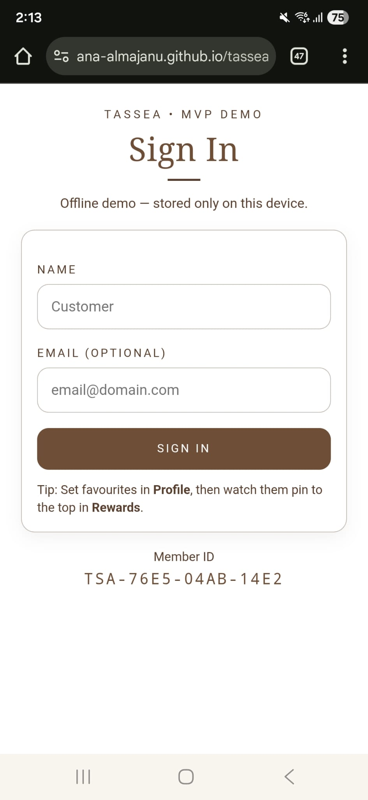
  <figcaption>Sign in / Access</figcaption>
</figure>

**Motivation (MVP):**

- **Initial value:** users can immediately access their unified loyalty wallet.

- **Future benefit:** enables account-based features (favourites, history, personalized feed later).

- **Feedback loop:** activation rate + drop-off points to validate clarity and usability.

---

#### **2) Rewards (unified loyalty wallet)**
The Rewards page aggregates progress across multiple cafés in one place, so users don’t need separate cards/apps. This is the core “must-have” because it delivers the most direct value and supports willingness-to-pay testing.

In our MVP logic:

- **Reward goal = 100 points**

- **1 purchase = 10 base points**, then a multiplier applies depending on the café (see favourites system).

<figure class="shot">
  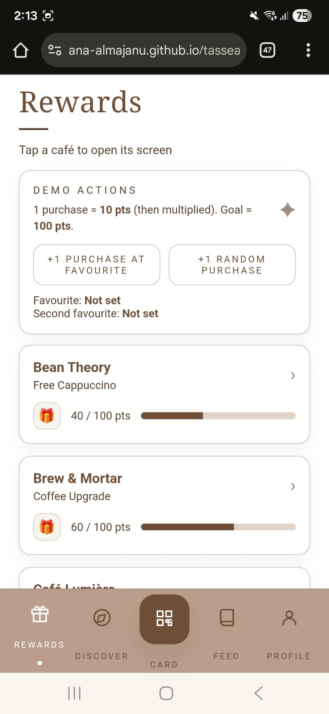
  <figcaption>Rewards list (overview across cafés)</figcaption>
</figure>

**Motivation (MVP):**

- **Initial value:** one place to track progress + rewards for multiple cafés.

- **Future benefit:** scalable to more cafés, reward types, and real POS validation.

- **Feedback loop:** what cafés users engage with, what rewards they target, and how often they return.

---

#### **3) Café “card” → dedicated café screen (details + actions)**
Instead of keeping cafés as static cards, tapping a café opens a **dedicated café screen**. This makes the MVP feel closer to a real product and helps validate what info users want per café.

On this screen, users can:

- see reward progress clearly (toward 100 pts),

- simulate purchases,

- claim a reward when ready.

<figure class="shot">
  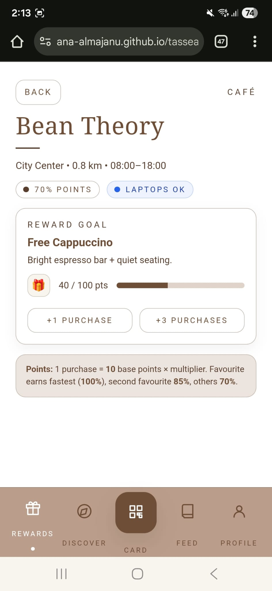
  <figcaption>Café detail screen (reward progress + actions)</figcaption>
</figure>

**Motivation (MVP):**

- **Initial value:** reduces confusion (“what does this café give me?”) and keeps actions context-specific.

- **Future benefit:** the same screen can later host real menus, offers, events, and partner promotions.

- **Feedback loop:** which cafés get opened most + which actions get used (purchase simulation vs claim).

---

#### **4) Favourite + Second Favourite system (loyalty + predictable customers)**
We added a **Favourite** and **Second Favourite** café system to increase customer loyalty and to support our business partners.

To reinforce this, we implemented a “faster rewards” incentive model:

- **100% of points** count toward rewards at the **favourite café**

- **85%** toward rewards at the **second favourite**

- **70%** toward rewards at **any other café**

<figure class="shot">
  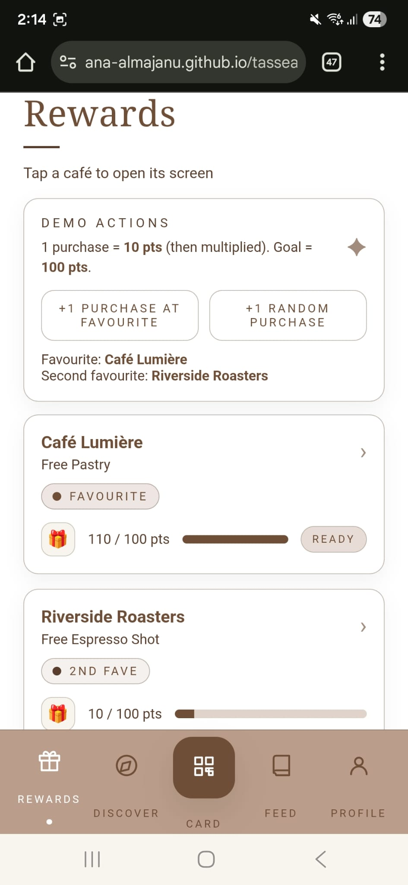
  <figcaption>Rewards with favourites pinned first + “Ready” state</figcaption>
</figure>

**Motivation (MVP):**

- **Initial value:** users can prioritize the cafés they actually visit most.

- **Business validation:** supports the partner promise (repeat customers, not just discovery).

- **Feedback loop:** we can measure how favourites influence purchase behaviour and reward redemption.

---

#### **5) Profile (manage favourites + independent “locked until claim” rule)**
The Profile page displays and explains the favourites system clearly (base points + multiplier). The key MVP rule is:

> **You can only change Favourite after you claim a reward at Favourite.  
> You can only change Second Favourite after you claim a reward at Second Favourite.**  
> (They are independent.)

<figure class="shot">
  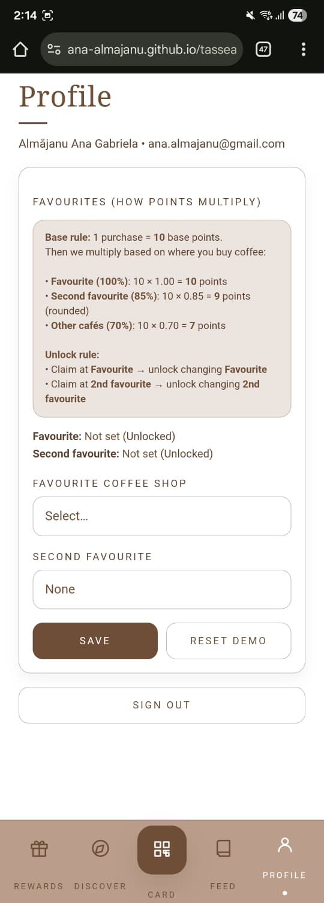
  <figcaption>Profile – selecting favourites</figcaption>
</figure>

<figure class="shot">
  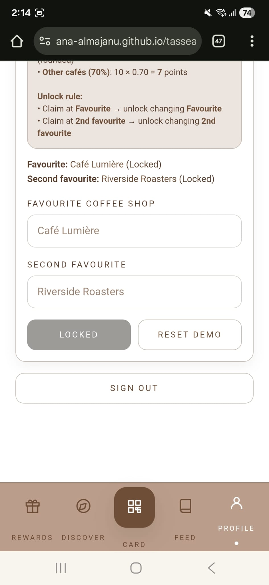
  <figcaption>Profile – favourites saved + locked</figcaption>
</figure>

**Motivation (MVP):**

- **Initial value:** users understand how to earn faster + can customize quickly.

- **Future benefit:** sets up meaningful personalization (offers/events tied to favourites later).

- **Feedback loop:** how often users try to change favourites + whether the lock rule feels fair or frustrating.

---

#### **6) Your Card (QR)**
We added a scannable QR-style card screen for checkout. This is essential to validate whether the “digital loyalty” experience feels practical in a real café environment.

<figure class="shot">
  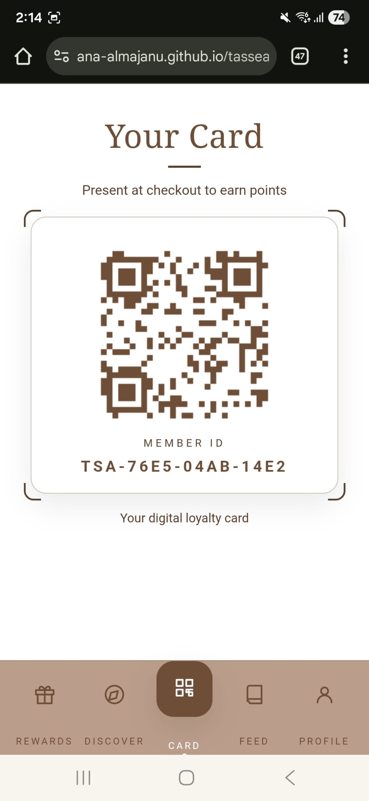
  <figcaption>Your Card (QR)</figcaption>
</figure>

**Motivation (MVP):**

- **Initial value:** one card users can show instantly.

- **Future benefit:** ready for integration with real staff scanning flows.

- **Feedback loop:** user + staff feedback on speed, clarity, and friction at checkout.

---

#### **7) Discover (clickable cafés + decision signals)**
Discover allows users to browse cafés and tap into their details screen. We show quick decision info (distance, hours) and prototype “signals” such as occupancy and a **“Laptops OK”** badge.

<figure class="shot">
  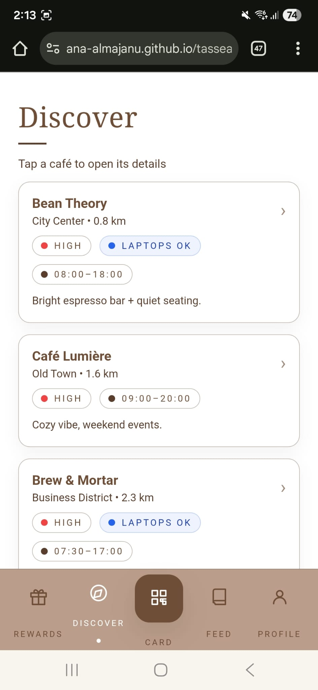
  <figcaption>Discover page (list view)</figcaption>
</figure>

**Motivation (MVP):**

- **Initial value:** helps users choose a café, not just track rewards.

- **Future benefit:** foundation for filters, personalization, and partner visibility.

- **Feedback loop:** what users click, what info matters most (hours, laptops, occupancy).

---

#### **8) Discover (map placeholder)**
We included a map-view placeholder to communicate the intended direction (interactive café map), without overbuilding it before validating demand.

<!-- keep your existing map placeholder image if you have it -->
<figure class="shot">
  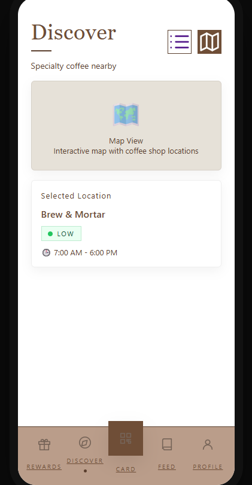
  <figcaption>Discover map placeholder</figcaption>
</figure>

**Motivation (MVP):**

- **Initial value:** communicates the location-based product vision.

- **Future benefit:** clear next-step feature if users request it.

- **Feedback loop:** if users repeatedly expect to use it, that signals map demand.

---

#### **9) Feed (prototype posts + post details + café link)**
We added a lightweight feed with example posts (new beans, café event) to test whether users value updates inside the app. Posts can open a detail view and can link back to the relevant café.

<figure class="shot">
  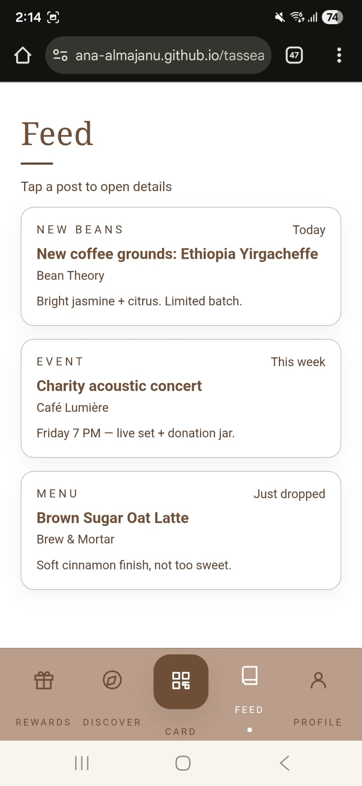
  <figcaption>Feed (sample posts)</figcaption>
</figure>

<figure class="shot">
  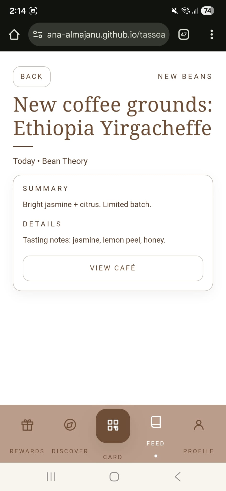
  <figcaption>Post details (with “View café” link)</figcaption>
</figure>

**Motivation (MVP):**

- **Initial value:** users see what’s new without leaving the loyalty/discovery ecosystem.

- **Future benefit:** supports partnerships (events, limited beans, promotions).

- **Feedback loop:** which post types users care about (events vs product drops) and whether it influences where they go.

---

### **Employee / Staff MVP (what the café team uses)**

To validate real-world feasibility, we also built an **employee-side MVP** that covers the minimum operational loop: “identify customer → add points / redeem → update café status → communicate updates”.

<figure class="shot">
  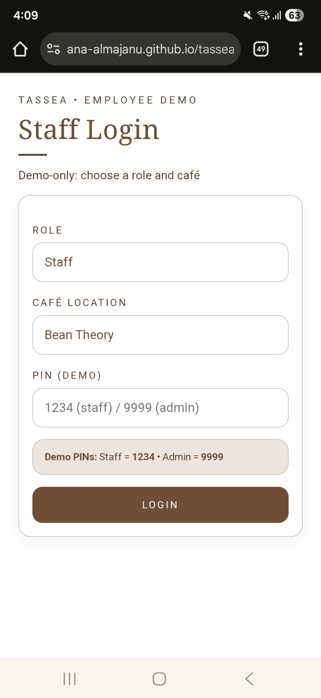
  <figcaption>Staff login (role + café selection)</figcaption>
</figure>

Core staff MVP features include:

1. **Scan customer QR / Member ID** (camera scanner + manual fallback) to load a customer at checkout.

<figure class="shot">
  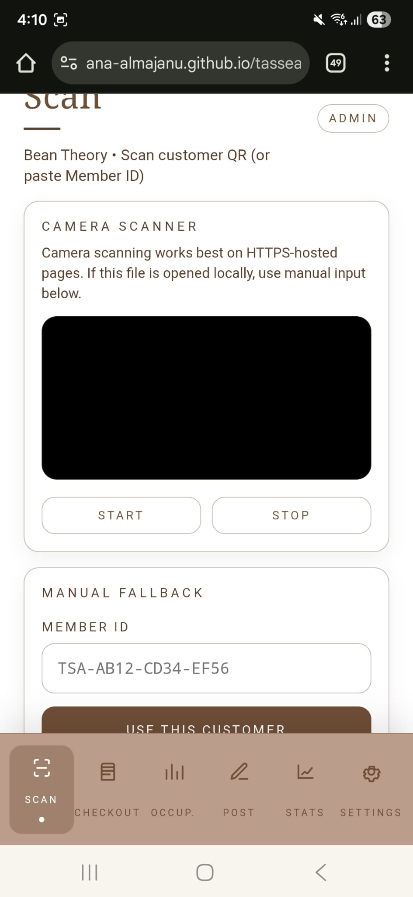
  <figcaption>Scan customer (camera + manual fallback)</figcaption>
</figure>

2. **Checkout actions:** add purchases (adds points) and **redeem reward** when the customer reaches the goal.

<figure class="shot">
  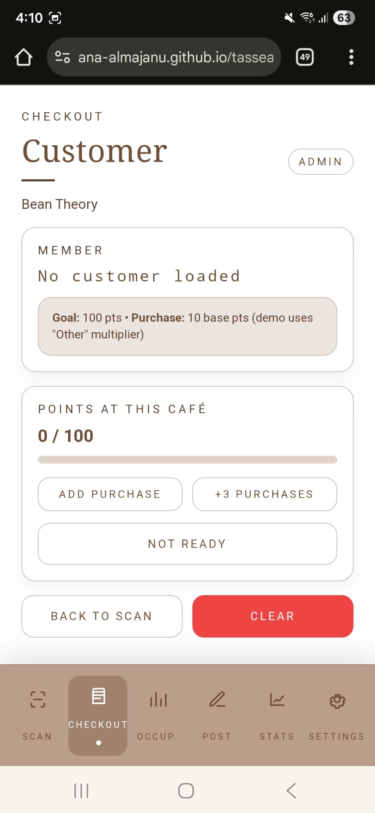
  <figcaption>Checkout (add points + redeem)</figcaption>
</figure>

3. **Occupancy update (once per hour):** set Low / Medium / High so customers can see how busy a café is in Discover.

<figure class="shot">
  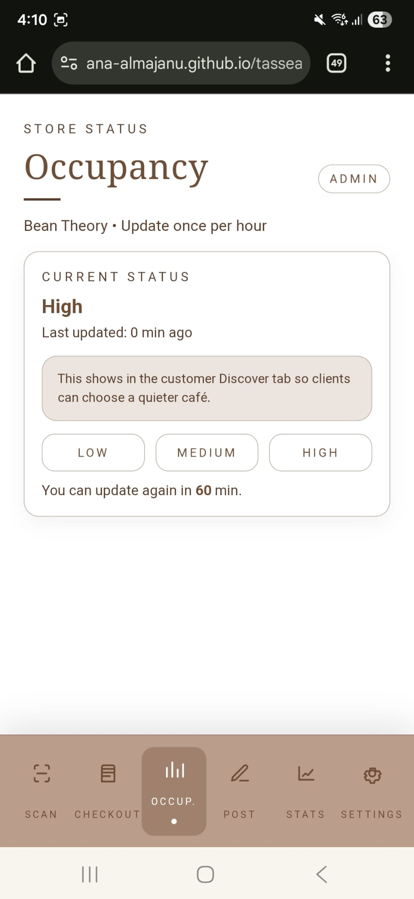
  <figcaption>Occupancy update (Low / Medium / High)</figcaption>
</figure>

4. **Post to Feed:** staff can publish a post (event / new beans / announcement), which appears in the customer feed.

<figure class="shot">
  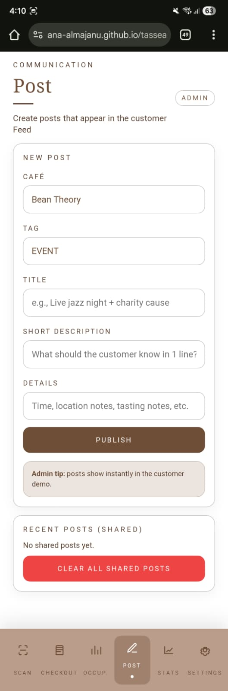
  <figcaption>Create post (publishes to customer feed)</figcaption>
</figure>

5. **Statistics page (MVP-level):** basic counters based on staff actions (scans, purchases, redemptions) to support business validation.

<figure class="shot">
  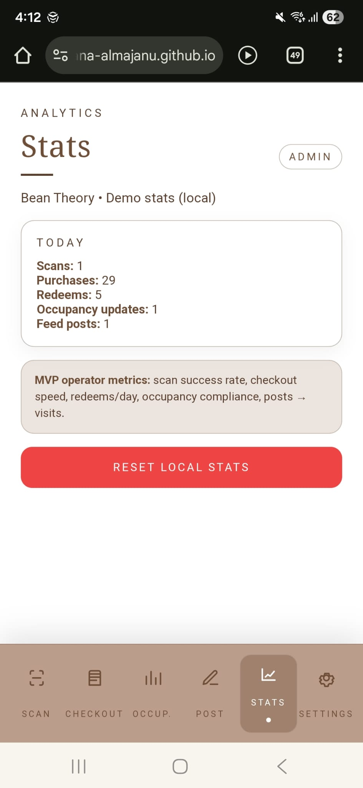
  <figcaption>Stats (MVP counters)</figcaption>
</figure>

6. **Settings page (read-only for staff):** visible, but not editable, to reflect real operational constraints.

<figure class="shot">
  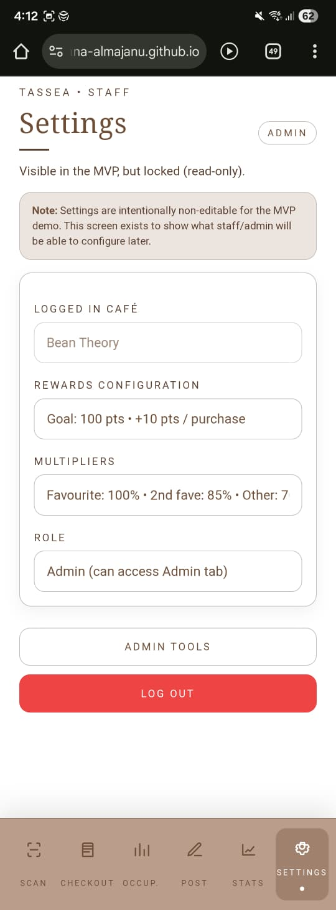
  <figcaption>Settings (read-only in MVP)</figcaption>
</figure>

<figure class="shot">
  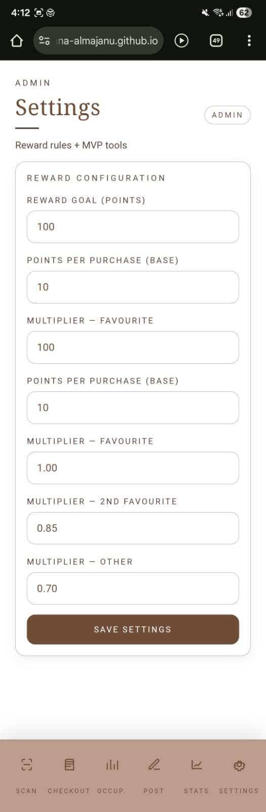
  <figcaption>Settings (read-only in MVP)</figcaption>
</figure>

7. **Logout:** to support shared devices or shift handover.

**Motivation (MVP):**

- **Initial value:** proves the concept can work at the counter without relying on “magic”.

- **Future benefit:** direct base for POS integration and partner dashboards.

- **Feedback loop:** staff friction points (speed, clarity), and business interest in basic stats.

---

<!-- ### **What we deliberately did NOT build (yet)**

To keep the MVP minimal and aligned with validation, we postponed:
- full café owner dashboard with advanced analytics
- payments/subscription billing inside the product
- real-time occupancy via sensors/POS
- push notifications
- social features (likes/comments/follow)
- complex admin tooling + permissions

These will only be prioritized after validating adoption and partner interest during pilot testing.

--- -->

### **Planned MVP usage validation (next step)**

The goal of this milestone is to get the MVP into the hands of users and confirm real usage and (later) willingness to pay.

We will run a small pilot (customers + partner cafés) and document the process on the Fiki with evidence, including:

- **Customer proof:** number of users who try it, what they do first, and whether they’d use it again next time they buy coffee

- **Partner proof:** owner/manager feedback + willingness to run a pilot (ex: agreement to test for 2–4 weeks, or a signed intent)

- **Operational proof:** staff feedback on checkout and whether it’s realistic during busy hours

We will track MVP-level signals such as:

- activation rate (sign-ins)

- favourite adoption rate + impact on reward claims

- reward redemption completion rate

- Discover engagement (taps into café details)

- Feed engagement (post views and café clicks)

- staff usability feedback (scan vs manual entry, time at checkout)

- partner interest in continuing / paying after pilot

This milestone results in an MVP that can be shown, used, and validated through real interactions and documented evidence — not assumptions.

## **Milestone 8 – First Sale**

**Goal: Get people to use the MVP.**

For this milestone we put the MVP in the hands of users/customers to confirm real usage and willingness to adopt the product.
Below is evidence from a user interview, documenting feedback after interacting with the MVP.

### **Evidence – MVP User Interview**

??? note "Tassea – MVP User Interview – (Participant) – Feedback"

    1. Cât de ușor ți se pare să înțelegi ce face aplicația în primele 30 de secunde?

    Foarte ușor, e totul super intuitiv. Nu cred că ar fi probleme pentru o persoană cu cunoștințe tehnice minime.

    2. Care e primul lucru pe care ai încerca să-l folosești (Rewards / Discover / Card / Feed / Profile) și de ce?

    Cred că Discover, doar pentru că aș vrea să știu. Mi se pare super tare funcționalitatea de „Laptops OK” pentru fiecare cafenea. Presupun că este vorba de existența prizelor lângă mese și așa mai departe. Discover, pentru chestia asta cu laptop-urile, mi se pare destul de cool.

    3. Cât de util ți se pare „Rewards wallet” (toate cafenelele într-un singur loc)? Ai folosi asta în viața reală?

    Da, mi se pare super util. Decât să fie 100 de aplicații pentru fiecare cafenea, e super ok.

    4. În mod realist, ai arăta un cod QR la casă? Ți se pare rapid sau incomod?

    Da, mi se pare foarte rapid, super ok. Deja, oricum, cred că urmează să se meargă pe chestia asta în foarte multe locații și magazine.

    5. Ce ți se pare neclar sau enervant la ecranul „Your Card”?

    N-aș ști să răspund aici, adică nu cred că are nevoie de mai mult. E super simplu, super ok de înțeles. Doar să nu fie probleme cu scanarea codului QR, dar nu cred că ar fi, ecranul fiind alb, codul fiind negru.

    6. Sistemul de „Favourite + Second Favourite” ți se pare ușor de înțeles?

    Da.

    7. Dacă primești mai repede recompensa la cafeneaua favorită (100% vs 85% vs 70%), ți-ar schimba asta comportamentul? Cum?

    Da, în sensul că aș rămâne loială cafenelei favorite. Cred că este destul de helpful și pentru cafenele, și pentru client.

    8. Ideea de 2 favourite (una aproape de casă și una aproape de muncă) ți se pare utilă sau inutilă?

    Mi se pare foarte utilă, e chiar super ok. Da, cred că a fost gândită cum trebuie.

    9. Regula „poți schimba favourite doar după ce revendici o recompensă” ți se pare corectă sau frustrantă? De ce?

    Pot să înțeleg conceptul, mai ales pentru cafenea în sine, ca să se asigure că au fidelitate, dar cred că ar fi ok și o opțiune de a avea, per client, o șansă pe lună să renunți la punctele astea, în cazul în care, spre exemplu, cafeneaua de lângă casa ta se închide.

    10. Când intri în Rewards, faptul că favourite apar primele te ajută sau nu contează?

    Da.

    11. Feed-ul cu postări (boabe de cafea noi / evenimente) ți se pare relevant sau ai ignora complet?

    Nu l-aș ignora. Nu pot să zic că mi s-ar părea enervant, chiar dacă nu l-aș folosi, dar eu personal l-aș folosi.

    12. Dacă ar lipsi o singură funcție din aplicație, care ar fi aceea care te-ar face să nu o mai folosești?

    Cred că funcția de Discover.

    13. Pe o scară de la 1 la 10, cât de probabil e să folosești această aplicație de fiecare dată când îți iei cafea?

    Aș zice 10.

    14. Ce ai schimba prima dată ca să fie „mai folosibil” (mai rapid / mai clar / mai frumos)?

    Nimic.

For the First Sale milestone, we focused on getting our MVP into the hands of a real potential user to validate early adoption and confirm that the core value proposition is immediately understandable and desirable. The interview feedback suggests the product is highly intuitive within the first 30 seconds, even for someone with only minimal technical knowledge, which is critical for lowering onboarding friction. The participant’s strongest interest was the Discover feature—especially the “Laptops OK” signal per café—indicating that contextual, practical information can be a key driver for exploration and repeat use. At the same time, the user described the Rewards wallet as genuinely useful in real life because it eliminates the pain of juggling many separate loyalty apps, reinforcing that the MVP solves a real consolidation problem. Importantly, the participant stated they would realistically scan a QR code at checkout and rated their likelihood of using the app every time they buy coffee as a 10/10, which supports our claim that the proposed flow is fast and acceptable in a real retail environment. Finally, the feedback validates our “Favourite + Second Favourite” logic (home/work) as easy to understand and behavior-shaping, while also highlighting a practical edge case: users may need a limited option to change favourites (e.g., monthly reset) if a café closes. Overall, this milestone provides concrete evidence that the MVP delivers value, is easy to use, and can drive repeated behavior—exactly what we need before pushing toward paid partnerships and transactional validation.

<!-- ## Summary

Through thorough customer discovery and behavioral validation, **Tassea** confirmed that the lack of a unified, digital loyalty experience is a real and recurring problem in the specialty coffee market.  
The proposed solution provides measurable value for both customers and business owners, laying the foundation for a sustainable and scalable platform.  
Built on validated insights, **Tassea** stands as a smart, data-driven bridge between coffee lovers and their favorite cafés.

pip install -U mkdocs mkdocs-material ghp-import
mkdocs build --clean
ghp-import -n -p -f site

--- -->