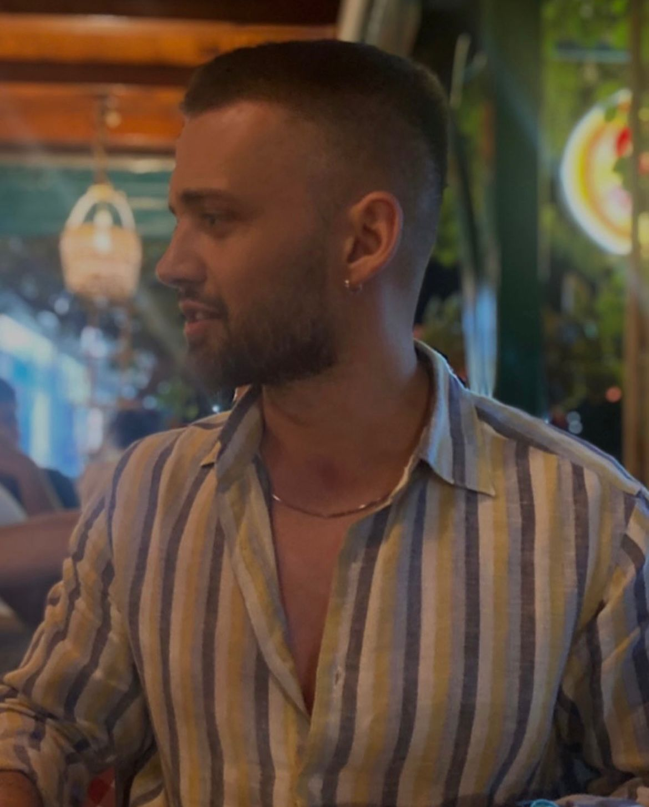

  
  <h1 class="hero-title">Tassea</h1>
  
The Smart Loyalty Platform for Coffee Lovers

  <a href="#project-description" class="hero-button">Explore the Project ↓</a>

---

# ☕ **Tassea – The Smart Loyalty Platform for Specialty Coffee Shops**

Welcome to **Tassea** — a platform designed for specialty coffee shops and their customers.  
This page outlines the project concept, team, problem, solution and business model.

---

## Team & Roles

| Name | Role | Email | Photo |
|------|------|--------|-------|
| Ana Gabriela Almăjanu | Project Manager & Backend Developer | [ana.almajanu@gmail.com](mailto:ana.almajanu@gmail.com) |  |
| Irene Mihaela Mușat | UI/UX Designer & Frontend Developer | [irenemiha@gmail.com](mailto:irenemiha@gmail.com) |  |
| Cristian Constantin | Mobile App Developer & Creative Director | [constantincristian05@icloud.com](mailto:constantincristian05@icloud.com) |  |
| Andrei Mihai Cosmin | Backend Engineer & Database Specialist | [andreimihaicosmin@yahoo.com](mailto:andreimihaicosmin@yahoo.com) |  |

> ☕ The team combines expertise in software development, UX design and business management to create a useful and scalable product.

---

## Problem Statement

Most **specialty coffee shops** don’t have a loyalty or fidelity program, even though this would help in attracting more customers.  
The traditional **stamp card system** is inconvenient, since customers often forget it at home or lose it.  

Creating an **individual digital app** for each coffee shop isn’t practical — it’s expensive, difficult to maintain, and there’s no widely adopted platform focused on specialty coffee shops.  
Existing “loyalty-only” apps bring little added value to the business.

---

## Solution / Value Proposition

**Tassea** aims to be a **shared platform** for specialty coffee shops that provides:

- **Core loyalty functionality** (customers collect points or stamps through recurring visits);  
- **Business analytics** with insights about customer behavior and trends;  
- **Real-time occupancy tracking**, helping users decide where to go based on crowd levels;  
- **Feedback & discovery features**, allowing customers to explore new shops and interact directly with owners.

> Tassea bridges the gap between customer engagement and valuable business data, creating a win-win ecosystem.

---

## Customer Segment

Tassea primarily targets **Gen Z** and **Millennials under 45 years old**, who frequently visit local coffee shops and use mobile apps daily.  
The segment can expand depending on the onboarding strategy and regional market.

---

## Competition

| Competitor | Description | Limitation |
|-------------|-------------|-------------|
| **Stampino** | Offers basic digital stamp cards. Users earn 1 stamp per visit and get a free coffee after 9 stamps. | Only one feature (loyalty cards), very limited coffee shop selection, and stamps don’t transfer between shops. |

---

## Tassea’s Advantage

Unlike competitors, **Tassea** goes beyond loyalty:

- Real-time occupancy information  
- Discovery page for exploring new coffee shops  
- Feedback and communication channel between customers and shop owners  
- Business analytics for shop owners  
- A cleaner, more engaging user experience  

These features add tangible value for both customers and businesses.

---

## Key Metrics

Tassea tracks and optimizes both customer and business performance indicators.

| Category | Metrics |
|-----------|----------|
| **B2C (Customer Side)** | New user signups, activation rate, daily active users (DAU), occupancy checks per user, user retention, churn rate |
| **B2B (Business Side)** | Number of partner coffee shops, monthly onboarding growth, shop retention, loyalty participation rate, churned coffee shops |

---

## Cost Structure

- Platform development and maintenance  
- Cloud hosting and database services  
- Design, marketing, and branding  
- Business partnerships and outreach  

---

## Revenue Streams

**Subscription model for coffee shops**, available in pricing tiers:

- ☕ **Basic** – $99/month  
- ☕ **Pro** – $149/month  
- ☕ **Enterprise** – custom plans for larger chains  

---

## Customer Discovery & Validation

Before developing the platform, the team conducted a detailed **Customer Discovery** process to confirm that the problem we aimed to solve was real and worth addressing.  
We approached this through **in-person interviews**, **interviews over the phone** and an **online survey** structured using the **Mom Test** framework, which focuses on real experiences and observable behavior rather than hypothetical scenarios.

---

### Interviews with different coffe shop owners

> The recordings for the interviews that took place over the phone can be found here: https://drive.google.com/drive/folders/1Bqm3PT7d_mWMIck6K7O33ANU9BYIiXeq

**Noi.2 Cafe – Coffess Shop Owner Interview**

1. Când vă gândiți la succesul vostru, cât de importantă este retenția clienților față de atragerea de clienți noi?
Depinde de grupul de clienți. Dacă vorbim de categoria 16–20 de ani, nu este foarte important să rămână constanți, pentru că în industria cafenelelor de specialitate, prețurile sunt destul de ridicate, iar acest grup de vârstă consumă foarte puțin. Mai important pentru o cafenea este să aibă o comunitate și un grup puternic cuprins între 25 de ani în sus, pentru că aceștia au putere de cumpărare și pe aceștia ne dorim să-i fidelizăm cât de bine putem. Dacă aș fi un 5toGo, atunci m-aș axa pe cât mai mulți clienți noi, cât mai mulți în fiecare zi. În cazul nostru, vreau să îmi țin clienții cât mai aproape, pentru că am categoria 25+.

2. Care simțiți că este cea mai mare provocare în a transforma un client care intră prima dată într-una din locații într-un client fidel?
În prezent, în noiembrie 2025, este prețul. S-a scumpit foarte mult materia primă, de asemenea și taxele și impozitele; acest dezechilibru economic din țară la momentul actual creează cea mai mare provocare de a menține prețuri competitive. Pe lângă acest aspect, cea mai mare provocare ar fi să-i oferi clientului aceeași calitate de luni până duminică.

3. Ați încercat vreodată în trecut un sistem de a răsplăti clienții fideli?
Da, avem. Clienții apreciază gratuități și discounturi.

4. Aveți vreo metodă acum prin care să puteți lua legătura direct cu cei mai fideli clienți ai voștri, separat de publicul larg de pe social media?
Avem o comunitate pe WhatsApp, unde postăm informații și oferte. Cei care doresc să intre ne scriu direct când vor să facă parte din comunitate, ori intră direct folosind linkul de pe pagina de Instagram. Sunt destul de puțini; nu este un engagement foarte mare pe partea aceasta.

5. Ați avut vreodată o situație în care ați fi vrut să știți mai multe despre tipologia clienților voștri (de ex. vârstă, frecvența vizitelor) pentru a lua o decizie de business? Puteți să-mi dați un exemplu?
Nu.

6. Gestionarea fluxului de clienți și a locurilor disponibile este vreodată o provocare?
Poate să fie. Fiind o locație cu număr de locuri limitat, în weekend mai întâmpinăm probleme când oamenii vin și văd că toate mesele sunt ocupate, dar face parte din fluxul de clienți, din viața unei cafenele. Nu aș numi asta o problemă; este ceva normal.

7. Simțiți că pierdeți clienți în orele de vârf pentru că locația pare plină din exterior sau pentru că timpul de așteptare e prea mare?
Sunt clienți care iau to-go. Clienții care vin de weekend, de la o plimbare, nu vin neapărat cu scopul de a găsi o masă. Dacă vin și găsesc loc, sunt fericiți; dacă nu, pleacă mai departe.

8. Să presupunem că lansați o nouă băutură, schimbați meniul sau organizați un eveniment. Cum anunțați clienții despre asta în momentul de față?
Instagram și WhatsApp. Plus, dacă evenimentul este vineri, de luni până joi spunem despre acesta tuturor celor care vin la cafenea.

---

**MUGSHOT – Coffess Shop Owner Interview**

1. Când vă gândiți la succesul vostru, cât de importantă este retenția clienților față de atragerea de clienți noi?
Destul de importantă, deoarece clienții vechi aduc clienți noi, fie prin mijloacele de socializare, fie prin viu grai.

2. Ați încercat vreodată în trecut un sistem de a răsplăti clienții fideli?
Da, fie le oferim reduceri consistente, fie le oferim ceva din partea casei.

3. Să presupunem că lansați o nouă băutură, schimbați meniul sau organizați un eveniment. Cum anunțați clienții despre asta în momentul de față?
Promovăm evenimentele prin social media, în special Instagram, dar și prin promovare offline în cafenea.

4. Aveți vreo metodă acum prin care să puteți lua legătura direct cu cei mai fideli clienți ai voștri, separat de publicul larg de pe social media?
Nu, din păcate, momentan nu.

5. Ați avut vreodată o situație în care ați fi vrut să știți mai multe despre tipologia clienților voștri (de ex. vârstă, frecvența vizitelor) pentru a lua o decizie de business? Puteți să-mi dați un exemplu?
Nu, pentru că în momentul de față este destul de ușor să ne dăm seama cine ne trece pragul și cât de des vin, fiindcă ne aflăm între trei colegii/universități/licee. De obicei, oaspeții de dimineață sunt studenți și elevi, iar cei de seară sunt fie oameni din comunitate, persoane din acest cartier, fie persoane care au auzit de noi și vor să încerce băuturile, în special cocktailurile.

6. Gestionarea fluxului de clienți și a locurilor disponibile este vreodată o provocare?
Nu, pentru că avem locuri oarecum limitate și știm cum să le organizăm în funcție de clienți.

7. Simțiți că pierdeți clienți în orele de vârf pentru că locația pare plină din exterior sau pentru că timpul de așteptare e prea mare?
Nu, nu ne-am confruntat cu această problemă până acum.

---

**Loom68 – Coffess Shop Owner Form Answers**

1. Când vă gândiți la succesul celor două locații, cât de importantă este retenția clienților față de atragerea de clienți noi?
Foarte importantă. Lucrăm constant prin marketing pentru a atrage clienți noi și pentru a ne mări comunitatea.

2. Ce faceți în prezent pentru a încuraja clienții să revină la Loom68?
Păstrăm calitatea serviciilor și găsim mereu soluții noi de fidelizare. De exemplu, am lansat propriul nostru brand de cafea, în parteneriat cu Origo.

3. Care considerați că este cea mai mare provocare în a transforma un client care intră prima dată în locație într-un client fidel?
Educarea lui în ceea ce privește specialty coffee și diferențierea noastră față de alte cafenele.

4. Ați încercat vreodată în trecut un sistem de răsplătire a clienților fideli Loom68?
Suntem în proces de a-l implementa.

5. Să presupunem că lansați o nouă băutură, schimbați meniul sau organizați un eveniment. Cum anunțați clienții despre asta în prezent?
Momentan doar prin Instagram, dar vrem să introducem și un newsletter pe e-mail.

6. Aveți acum vreo metodă prin care să luați legătura direct cu cei mai fideli clienți ai voștri, separat de publicul larg de pe Instagram?
În afară de Instagram, nu avem nimic direct.

7. Cum realizați în prezent o analiză a clienților care vizitează Loom68 și a trendurilor, precum orele cele mai aglomerate sau cele mai comandate produse din meniu?
Prin intermediul rapoartelor de vânzări, al stocurilor și al datelor din Google Maps privind orele de vârf la care oamenii caută cafeneaua.

8. Ce fel de date despre vânzări sau clienți urmăriți în prezent? Folosiți rapoartele de la casa de marcat (POS)?
Da, folosim programul de vânzare, foi de calcul și rapoarte legate de bonul mediu și de situația financiară.

9. Ați avut vreodată o situație în care ați fi vrut să știți mai multe despre tipologia clienților voștri (de exemplu: vârstă, frecvența vizitelor) pentru a lua o decizie de business pentru Loom68? Puteți să-mi dați un exemplu?
Până acum nu ne-am confruntat cu o astfel de situație, dar mi-ar plăcea să avem acces la astfel de informații.

10. Gestionarea fluxului de clienți și a locurilor disponibile este vreodată o provocare?
Momentan nu, dar pregătim ceva destul de radical în privința asta.

11. Simțiți că pierdeți clienți în orele de vârf pentru că locația pare plină din exterior sau din cauza timpului de așteptare prea mare?
Nu.

---

### Online survey targeting customers

Participants revealed that most specialty coffee shop visitors rarely or inconsistently use loyalty cards. Many said they **forgot or lost** their physical card, while shop owners confirmed they lack a simple, unified digital solution for customer retention.  
This confirmed that the problem wasn’t about disinterest but rather about **inconvenience and fragmentation** in existing systems.

The insights showed clear trends:  
- **67%** of respondents don’t use loyalty cards regularly.  
- **100%** expressed frustration after losing or forgetting a card.  
- **50%** abandoned a loyalty program due to complexity.  

Beyond loyalty, **83%** of participants said they had left a café because it was too crowded — a key validation for adding **real-time occupancy tracking**.  
They also shared that **Instagram** is their main source for discovering cafés, while **83%** delete retail app notifications immediately, suggesting that **pull-based engagement** works better than intrusive push notifications.

---

### Key Research Insights

| Question Focus | Main Finding | Validation Insight |
|----------------|---------------|--------------------|
| Why return to a café? | Quality and atmosphere matter most | Loyalty should support, not replace, experience |
| Use of loyalty cards | Low adoption (67% non-users) | Confirms usability gap |
| Forgotten card experiences | 100% frustration | Strong emotional pain point |
| Abandoning loyalty programs | 50% due to complexity | Need for simplicity |
| Leaving cafés due to crowds | 83% of users | Validates occupancy tracking feature |
| Discovering cafés/events | 67% via Instagram | Social-first marketing strategy |
| Notification behavior | 83% delete instantly | Avoid push; use pull UX |
| Curiosity about popular drinks | 83% interest | Opportunity for gamification and social proof |

---

## Product Impact

| Research Insight | Design Decision |
|------------------|----------------|
| Lost or forgotten cards | Introduced fully digital loyalty wallet |
| Complexity discourages users | One-tap stamp and reward collection |
| Overcrowding issues | Added real-time occupancy tracking |
| Notification fatigue | Replaced push notifications with in-app updates |
| Instagram discovery behavior | Built marketing around social-first channels |
| Curiosity for trends | Introduced “Top Drinks” leaderboard and discovery feed |

---

### From Discovery to Validation

These findings guided the development of **Tassea’s MVP**, focusing only on the most validated and high-value features.  
The problem has been verified through user behavior, emotional responses, and measurable patterns.  
The proposed solution aligns directly with what customers and café owners actually need: a digital, unified, simple, and data-driven loyalty experience.

Having confirmed the problem’s validity, the team is ready to move forward to the **Customer Validation stage**, where the goal is to test **real-world adoption** and **willingness to pay** through pilot programs with local coffee shops.  
Future testing will include A/B experiments with different reward structures, engagement metrics, and business conversion rates.

All evidence — including survey data, interview summaries, and the full analysis — has been archived and attached as proof of the discovery phase.

---

## Milestone 3

**Landing Page** -https://irenemiha.github.io/Tassea-Landing-Page/

**Wireframe** - https://www.figma.com/design/JDFKhxI5rnJhUW1H8a17LA/Tassea-mobile-wireframe?node-id=0-1&t=nqhdsxksdpX9vvM0-1

---
# **Milestone 4 – Face-to-Face Interviews, Persona, User Stories, Use Cases & Updated Wireframes**

## **1. Face-to-Face User Interviews**

### 📂 Link către înregistrări interviuri  
https://drive.google.com/drive/folders/XXX *(înlocuiește cu linkul tău)*

---

# **INTERVIURI FACE-TO-FACE CU OAMENI CE APARTIN TARGETED CUSTOMER SEGMENT**

=== "Interviu: Ana & Marius"

    **Ana**  
    Bună. Povestește-mi de ultima dată când ai folosit o aplicație de loialitate pentru o cafenea de specialitate.  
    Cum a fost procesul pas cu pas?

    **Marius**  
    Nu cred că am folosit vreodată o aplicație de genul. Pare ceva ce poate ar trebui să folosesc, dar doar îmi place să dau mulți bani.  
    Nu folosesc.

    **Ana**  
    Ce aplicații folosești în momentul de față, care stochează toate cardurile de loialitate pentru diverse cafenele?

    **Marius**  
    Presupun că aș folosi ceva gen Apple Wallet sau Google Wallet, sau… nu știu, cred că așa se numesc.

    **Ana**  
    Ok. Ce frustrări ai întâmpinat în procesul curent de a folosi un card de loialitate?

    **Marius**  
    Având în vedere că n-am folosit până acum, niciuna.

    **Ana**  
    Ce frustrare ai întâmpinat când ai vrut să vezi cât de ocupată este o cafenea?

    **Marius**  
    Niciuna, adică, de obicei, mă uit pe geam și văd.

    **Ana**  
    Cât de des folosești cardul de loialitate?

    **Marius**  
    Destul de rar.

    **Ana**  
    Când te-ai lovit ultima dată de un moment în care ai fi vrut ca procesul să fie mai ușor pentru folosirea unor carduri de loialitate?

    **Marius**  
    La un moment dat foloseam card de loialitate la Mega Image și s-a actualizat aplicația și mi-a uitat cardul, iar eu nu mi l-am mai pus din nou, că era prea complicat.

    **Ana**  
    Ok, e în regulă. Acum o să-ți arăt aplicația.  
    Aici este ecranul de login.  
    Aici apare cardul de loialitate. Pentru ce crezi că este acest ecran?

    **Marius**  
    Păi probabil pentru rewards, având în vedere că scrie.

    **Ana**  
    Dacă ai vrea să folosești un card de loialitate pentru a revendica un premiu, pe ce butoane ai apăsa?

    **Marius**  
    Nu știu, ori de jos, de la „Rewards”, sau...  
    Pentru prima cafenea aș apăsa pe săgeată sau pe cardul ăla.

    **Ana**  
    Ok. Este ceva neclar sau neașteptat în procesul de a folosi această aplicație?

    **Marius**  
    Nu știu, pare ok.

    **Ana**  
    Ți se pare că lipsește vreun pas sau vreo informație necesară?

    **Marius**  
    N-aș zice.

    **Ana**  
    Ce crezi că se va întâmpla dacă apeși butonul de „Feed”?

    **Marius**  
    Habar n-am.

    **Ana**  
    Ți se pare un proces greoi sau ok?

    **Marius**  
    Nu mi-am dat seama cum s-ar sincroniza cardurile. Asta nu e clar.

    **Ana**  
    Pornind de la ce ai văzut, când ai avut nevoie să vezi câte puncte ai?

    **Marius**  
    Nu știu, nu cred că m-am uitat vreodată.

    **Ana**  
    Ce faci acum pentru a urmări punctele?

    **Marius**  
    Nimic, nu am card.

    **Ana**  
    Ce te-ar face să folosești aplicația?

    **Marius**  
    Să fie super rapidă (10 secunde).

    **Ana**  
    Care a fost ultima dată când ai economisit timp cu o aplicație de loialitate?

    **Marius**  
    Niciodată.

    **Ana**  
    Poți să-mi povestești o situație în care ai fi vrut o aplicație ca aceasta?

    **Marius**  
    Nu.

    **Ana**  
    Ce funcții folosești într-o aplicație similară?

    **Marius**  
    Rewards, dar nu Discovery.

    **Ana**  
    O aplicație pe care nu ai mai folosi-o?

    **Marius**  
    Mega Image – mi-a pierdut cardul și m-am lăsat.

    **Ana**  
    Ok, mulțumesc.

=== "Interviu: Ana & Ilinca"

    **Ana**  
    Bună.

    **Ilinca**  
    Bună.

    **Ana**  
    Povestește-mi de ultima dată când ai folosit o aplicație de loialitate...

    **Ilinca**  
    Ultima dată a fost acum 1–2 săptămâni.  
    Procesul e simplu: deschid cardul și îl arăt.

    **Ana**  
    Ce aplicații folosești acum?

    **Ilinca**  
    Wallet de la telefon. E mai rapid, îl deschid prin dublu clic.

    **Ana**  
    Frustrări?

    **Ilinca**  
    Uneori cardurile nu merg. Nu știu de ce.  
    Legat de cât de ocupată e o cafenea… nu stau acolo, iau cafeaua to go.

    **Ana**  
    Cât de des folosești cardul?

    **Ilinca**  
    O dată pe săptămână.

    **Ana**  
    Când ai vrut proces mai ușor?

    **Ilinca**  
    Când mi-am făcut cardul prima dată – nu mergea să mă găsească în sistem.

    **Ana**  
    Acesta este ecranul de Rewards. Ce crezi că este?

    **Ilinca**  
    Cardurile.

    **Ana**  
    Dacă ai vrea să revendici un premiu?

    **Ilinca**  
    Pe iconița de cadou.

    **Ana**  
    Ceva neclar?

    **Ilinca**  
    E un pic monotonă aplicația. N-are nimic care să te atragă.

    **Ana**  
    Lipsește vreun pas?

    **Ilinca**  
    Nu, dar sunt aranjate în așa fel încât nu-ți vine să apeși pe ele.

    **Ana**  
    Ce se întâmplă dacă apeși pe Feed?

    **Ilinca**  
    Probabil apar mai multe cafenele sau informații.

    **Ana**  
    Te-ai simțit blocată?

    **Ilinca**  
    La partea de unde revendici premiul – nu sare în ochi.

    **Ana**  
    Când ai avut nevoie să verifici punctele?

    **Ilinca**  
    Când am primit un mail că am atins un anumit număr, dar de obicei intru în aplicația cafenelei.

    **Ana**  
    Ce te face să folosești aplicația?

    **Ilinca**  
    Simplitatea și faptul că nu caut în emailuri.  
    Ce m-ar îndepărta: acces greoi la puncte.

    **Ana**  
    Ce funcții folosești cel mai mult?

    **Ilinca**  
    Punctele. Nu folosesc Near Me.

    **Ana**  
    O aplicație pe care ai încetat să o folosești?

    **Ilinca**  
    Starbucks – cardul lor nu mergea nici la plată, nici la scanare.

    **Ana**  
    Mulțumesc.

---

# **2. User Persona**

## Persona – *The Busy Coffee Lover*
- Nume: Ilinca Popescu  
- Vârstă: 21  
- Ocupație: Studentă  
- Motivatii: procese rapide, clare  
- Pain points: carduri care nu merg, UI monotone, premii greu de găsit  
- Nevoi: claritate, vizibilitate, 0 fricțiune

---

# **3. User Stories**

- Ca utilizator, vreau să adaug un card în <10 secunde.  
- Ca utilizator, vreau să văd câte puncte am clar.  
- Ca utilizator, vreau un UI atractiv.  
- Ca utilizator, vreau procese fără erori.

---

# **4. Use Cases / User Flows**

### Flow – Revendicare premiu
1. Intră în Rewards  
2. Selectează card  
3. Apasă Redeem  
4. Se afișează QR  
5. Barista scanează  

### Flow – Add Card
1. Add Card  
2. Select coffee shop  
3. Scan QR  
4. Card added  

---

# **5. Updated Wireframes**

Modificări necesare:
- butonul Redeem vizibil  
- carduri mai vizibile  
- ghid scurt  
- login simplificat  
- indicator puncte  
- funcția Feed clarificată  

---

# **6. Concluzie**

Interviurile au confirmat nevoia de simplitate, claritate și viteză. Wireframe-urile și fluxurile au fost actualizate ca răspuns direct la feedback-ul real al utilizatorilor.

### Summary

Through thorough customer discovery and behavioral validation, **Tassea** confirmed that the lack of a unified, digital loyalty experience is a real and recurring problem in the specialty coffee market.  
The proposed solution provides measurable value for both customers and business owners, laying the foundation for a sustainable and scalable platform.  
Built on validated insights, **Tassea** stands as a smart, data-driven bridge between coffee lovers and their favorite cafés.

---
